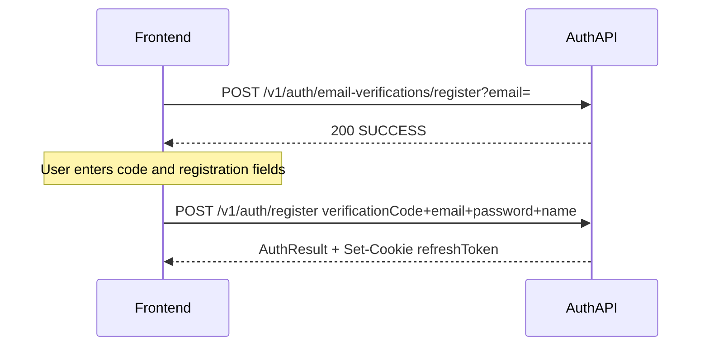
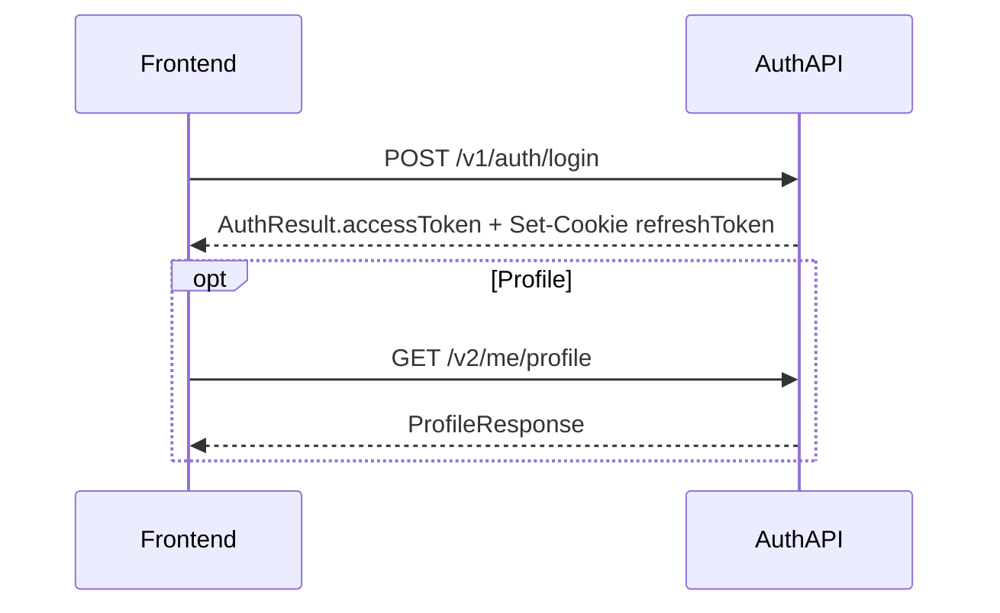
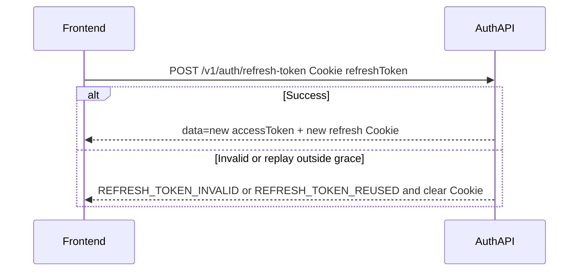
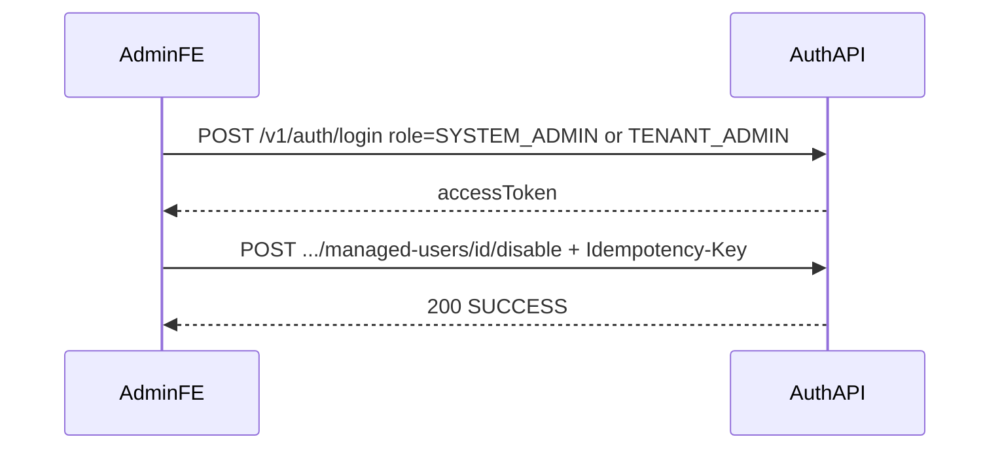
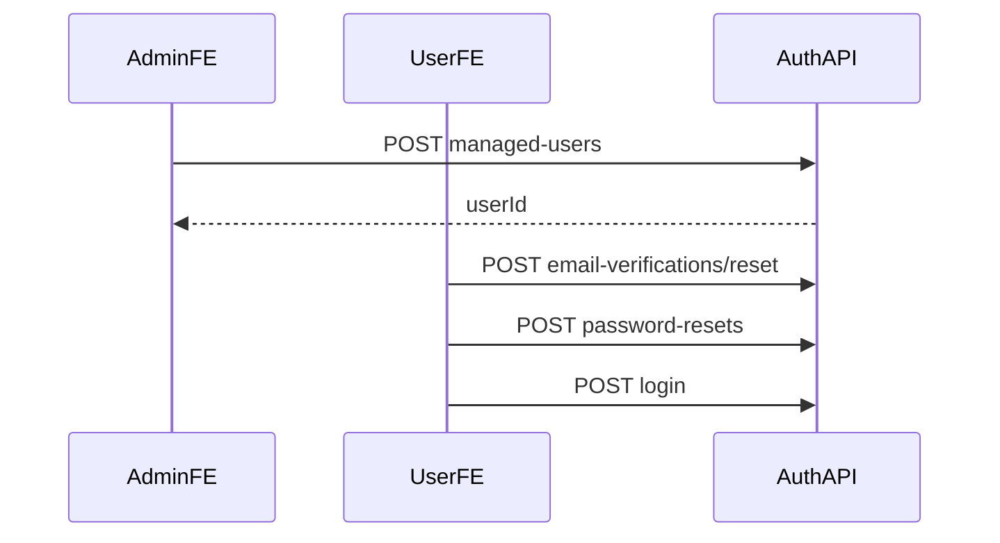

# Auth Module API Reference (Frontend)

Login / register / refresh / logout / email verification / password change / password reset, plus system/tenant managed-user APIs.  
Base URL: `http://localhost:8080/api`

Remote: `https://dev.xlearnedu.com:8080/api`

Profile, avatar, and Users CRUD: see [`user_module-api.en.md`](./user_module-api.en.md).

---

## Table of contents

1. [How to call](#1-how-to-call)
2. [Typical business flows](#2-typical-business-flows)
3. [Roles and login routing](#3-roles-and-login-routing)
4. [Session API](#4-session-api)
5. [Email verification and password](#5-email-verification-and-password)
6. [Admins (read-only)](#6-admins-read-only)
7. [Managed users](#7-managed-users)
8. [Endpoint cheat sheet](#8-endpoint-cheat-sheet)
9. [Local test accounts](#9-local-test-accounts)

---

## 1. How to call

### 1.1 Headers

| Header | When required |
|--------|----------|
| `Authorization: Bearer {accessToken}` | Authenticated APIs (password change, managed-users, admin reads) |
| `Idempotency-Key: {uuid}` | **Only the write APIs listed below** (new UUID per request) |
| `Content-Type: application/json` | JSON body |

**Auth write APIs that require `Idempotency-Key`:**

- `PUT /v1/auth/password`
- `POST /v1/auth/password-resets`
- All writes under `/v2/system/managed-users...` and `/v2/tenant/managed-users...`

Rules:

- Generate a **new** `Idempotency-Key` for each new business operation.
- On timeout/network **retry of the same operation**, reuse the original Key with identical Method, Path, Query, and Body.
- Same Key + different payload → `409 IDEMPOTENCY_KEY_MISMATCH`.
- In-progress duplicate → `409 IDEMPOTENCY_REQUEST_IN_PROGRESS`.
- Redis down → `503 IDEMPOTENCY_STORE_UNAVAILABLE`.
- Successful responses are cached ~**24 hours** by default.

Missing key → `IDEMPOTENCY_KEY_REQUIRED`.

**Does not require** a key: `login` / `register` / `refresh-token` / `logout`, send verification code, all GETs.

Invalid / missing auth → unified `ApiResponse`: `401` + `INVALID_TOKEN` / `UNAUTHORIZED` (Filter and EntryPoint).

```json
{
  "status": 401,
  "code": "INVALID_TOKEN",
  "message": "Invalid Access Token",
  "timestamp": "2026-07-28T01:00:00Z"
}
```

### 1.2 Anonymous (JWT not checked)

- `GET /v1`
- `POST /v1/auth/login`
- `POST /v1/auth/register`
- `POST /v1/auth/refresh-token`
- `POST /v1/auth/logout`
- `POST /v1/auth/email-verifications/register`
- `POST /v1/auth/email-verifications/reset`
- `POST /v1/auth/password-resets`

`PUT /v1/auth/password` **requires** Bearer.

> There are **no** `.../register/validate` or `.../reset/validate` endpoints. Codes are consumed atomically inside `register` / `password-resets` (order: static validation → consume → then conflict/identity lookup for anti-enumeration).

### 1.3 Cookie: `refreshToken`

| | |
|--|--|
| Set by | Successful `login` / `register` / `refresh-token` via `Set-Cookie` |
| Attributes | HttpOnly, Secure, SameSite=Lax, path=/, ~14 days |
| In JSON? | **No.** `AuthResult.refreshToken` is write-only for the server cookie |
| Same-origin | Browser sends Cookie by default |
| Cross-origin | Credentialed Request (`credentials: 'include'`). **TEMP FE integration**: allows `http://localhost:*` / `http://127.0.0.1:*` via `auth.cors.allowed-origin-patterns`. Tighten to explicit Origins before production; bare `*` is not allowed |

### 1.4 Unified JSON response

On success read `data`; on failure read `code`. Global `NON_NULL`: when `data` or `mustChangePassword` is null the field may be omitted — do not assume every response includes `data`.

```json
{
  "status": 200,
  "code": "SUCCESS",
  "data": {},
  "message": "Success",
  "timestamp": "2026-07-25T01:00:00Z"
}
```

### 1.5 Password rules

At least **8** characters, and must contain both **letters** and **digits**. Otherwise `INVALID_PASSWORD_FORMAT` (before code consume — does not spend the code).

### 1.6 `mustChangePassword`

Login `AuthResult` may include `mustChangePassword` (boolean; null/omitted means false).

When `mustChangePassword=true`, the backend **enforces**:

- HTTP `403`, `code=PASSWORD_CHANGE_REQUIRED` on normal business APIs
- Still allowed: `PUT /v1/auth/password`, `POST /v1/auth/logout`, `POST /v1/auth/refresh-token` (last two are public)

Managed users should set their first password via the forgot-password flow (§2.8), not via unknown internal passwords on `PUT /password`.
After change/reset, the flag is cleared, sessions invalidated — login again.

---

## 2. Typical business flows

### 2.1 Public registration (two steps)

Call in order:

1. `POST /v1/auth/email-verifications/register?email=...` — send code  
2. `POST /v1/auth/register` — body includes `verificationCode` (**no** intermediate validate)



On success: fixed `role=USER`, `level=STUDENT`, bound to `tenantId=1`; response includes `accessToken` and sets refresh Cookie.

### 2.2 Login

1. `POST /v1/auth/login` (body: `email`, `password`, `role`) → store `data.accessToken`  
2. Cookie automatically holds `refreshToken` (do not read it from JSON)  
3. (Optional) profile: `GET /v2/me/profile` (see User docs; USER / TENANT_ADMIN only)  
4. If `mustChangePassword === true`: go to [§2.6 Change password](#26-change-password-while-logged-in) first



`role` selects which account table to use — see [§3](#3-roles-and-login-routing).

### 2.3 Token refresh

1. Browser sends Cookie `refreshToken`  
2. `POST /v1/auth/refresh-token` → `data` is the **new accessToken string** (not an object)  
3. Server rotates the refresh Cookie  



- Same IP >10 calls in ~60s → `TOO_MANY_REQUESTS`  
- Rotation has a short grace window (default ~30s); replaying an old refresh outside grace → `REFRESH_TOKEN_REUSED`, Cookie cleared, login again  

### 2.4 Logout

1. `POST /v1/auth/logout` (**anonymous allowed**; uses Cookie; Bearer not required)  
2. Server deletes that refresh and clears the Cookie  

Then discard the local `accessToken`.

### 2.5 Forgot password (two steps)

1. `POST /v1/auth/email-verifications/reset?email=...` — send reset code  
2. `POST /v1/auth/password-resets` — body: `email` + `verificationCode` + `newPassword`, **requires** `Idempotency-Key`  

```mermaid
sequenceDiagram
  participant FE as Frontend
  participant API as AuthAPI
  FE->>API: POST /v1/auth/email-verifications/reset?email=
  API-->>FE: 200 SUCCESS
  FE->>API: POST /v1/auth/password-resets + Idempotency-Key
  API-->>FE: 200 SUCCESS
  Note over FE: Sessions invalidated; prompt re-login
```

Sessions are invalidated; call `login` again.

### 2.6 Change password while logged in

1. `PUT /v1/auth/password` (Bearer + `Idempotency-Key`)  
2. Body: `currentPassword`, `newPassword` (identity from JWT — **do not** send email/role)  
3. On success refresh sessions are invalidated → login again  

Applies when JWT `role` is `USER`, `TENANT_ADMIN`, or `SYSTEM_ADMIN`.

### 2.7 Disable managed user

Admin logs in for a Bearer token, then:

1. `POST /v2/system/managed-users/{id}/disable` (SYSTEM_ADMIN)  
   or `POST /v2/tenant/managed-users/{id}/disable` (TENANT_ADMIN, same tenant)  
2. Account → `DISABLED`; enrollments withdrawn; USER / TENANT_ADMIN sessions invalidated  



### 2.8 Managed-user first password setup

Admins **cannot** see or set the user password; this release **does not** email a temporary password.

1. Admin: `POST .../managed-users` → `userId` (`mustChangePassword=true`)
2. Tell the user to use forgot-password with their email:
   - `POST /v1/auth/email-verifications/reset?email=...`
   - `POST /v1/auth/password-resets` (`email` + `verificationCode` + `newPassword`)
3. User: `POST /v1/auth/login`



---

## 3. Roles and login routing

Two layers:

| Concept | Values | Purpose |
|---------|--------|---------|
| Login body `role` (`LoginAccountType`) | `USER` \| `TENANT_ADMIN` \| `SYSTEM_ADMIN` \| `ADMIN` | **Which table to query** (user vs admin) |
| JWT / authz `RoleEnum` | `USER` \| `TENANT_ADMIN` \| `SYSTEM_ADMIN` | Authorization role |

Routing:

| Login body `role` | Table | JWT role |
|-------------------|-------|----------|
| `USER` | user | `USER` |
| `TENANT_ADMIN` | user | `TENANT_ADMIN` |
| `SYSTEM_ADMIN` | admin | `SYSTEM_ADMIN` |
| `ADMIN` (legacy FE) | admin | `SYSTEM_ADMIN` |

`level` (user-table global field only): `STUDENT` \| `INSTRUCTOR` \| `NOT_APPLICABLE`.  
Public registration always `STUDENT`; `TENANT_ADMIN` forced to `NOT_APPLICABLE`.  
Course **TA** is a Course Enrollment Role — **not** a global user `level` (writing `TA` as global level is rejected).

| Capability | USER | TENANT_ADMIN | SYSTEM_ADMIN |
|------------|:----:|:------------:|:------------:|
| Public self-register | ✓ | | |
| Login / refresh / logout | ✓ | ✓ | ✓ |
| `/v2/me/profile` | ✓ | ✓ | (no me profile for admin) |
| Change own password | ✓ | ✓ | ✓ |
| `/v2/tenant/managed-users` | | ✓ | |
| `/v2/system/managed-users`, `GET /v2/admins` | | | ✓ |

Course Instructor / TA / Student gates are documented in the Course API; they are not the same as platform `level` alone.

---

## 4. Session API

Prefix: `/v1/auth` (health: `GET /v1`)

### 4.1 Health — `GET /v1`

No auth. Success: `data` is `"访问成功"`.

---

### 4.2 Login — `POST /v1/auth/login`

| | |
|--|--|
| Auth | No |
| Idempotency-Key | No |

**Body**

| Field | Type | Required | Notes |
|-------|------|----------|-------|
| email | string | yes | |
| password | string | yes | |
| role | string | yes | See §3; must match account type |

```json
{
  "email": "regtest1@example.com",
  "password": "Test12345",
  "role": "USER"
}
```

Success `data` (`AuthResult`):

```json
{
  "userId": 385,
  "email": "regtest1@example.com",
  "name": "Alex Rivera",
  "username": "regtest1",
  "role": "USER",
  "level": "STUDENT",
  "avatar": "http://localhost:8080/api/v2/users/385/avatar?v=...",
  "accessToken": "eyJ...",
  "mustChangePassword": false
}
```

- Also `Set-Cookie: refreshToken=...`
- `avatar` may be `null`
- Admin login: JWT role is `SYSTEM_ADMIN` (even if body used `role=ADMIN`); `avatar` may be a raw DB value
- `mustChangePassword` may be `true` for managed users on first login

About **5** consecutive failures lock for ~15 minutes; callers still see `INVALID_CREDENTIALS` (anti-enumeration).  
Redis down → `AUTH_SERVICE_TEMPORARILY_UNAVAILABLE`.

Other errors: `PARAM_MISSING`, `TOKEN_CREATION_FAILED`.

---

### 4.3 Register — `POST /v1/auth/register`

| | |
|--|--|
| Auth | No |
| Idempotency-Key | No |
| Prerequisite | Must have received a register verification code (~10 min TTL) |

**Body**

| Field | Type | Required | Notes |
|-------|------|----------|-------|
| email | string | yes | |
| verificationCode | string | **yes** | Consumed in this request |
| password | string | yes | See §1.5 |
| name | string | yes | Display name |
| username | string | no | Defaults to email local-part |
| tenantId | int | no | Server **always binds tenant 1**; client value ignored |

```json
{
  "email": "newuser@example.com",
  "verificationCode": "123456",
  "password": "Test12345",
  "name": "New User"
}
```

Success: same shape as login `AuthResult` + refresh Cookie.  
Fixed: `role=USER`, `level=STUDENT`, `tenantId=1`, `emailNotifications=true`.

Errors: `PARAM_MISSING`, `INVALID_VERIFICATION_CODE`, `VERIFICATION_CODE_EXPIRED`, `VERIFICATION_ATTEMPTS_EXCEEDED`, `INVALID_PASSWORD_FORMAT`, `BAD_REQUEST` (e.g. email already exists; message may be generic).

---

### 4.4 Refresh token — `POST /v1/auth/refresh-token`

| | |
|--|--|
| Auth | No (Cookie `refreshToken`) |
| Idempotency-Key | No |
| Rate limit | Same IP >10 in ~60s → `TOO_MANY_REQUESTS` |

Success: `data` is the **new accessToken string**; refresh Cookie rotated.

```json
{
  "status": 200,
  "code": "SUCCESS",
  "data": "eyJ...",
  "message": "Success"
}
```

Errors: `REFRESH_TOKEN_INVALID`, `REFRESH_TOKEN_REUSED` (clears Cookie), `TOO_MANY_REQUESTS`, `AUTH_SERVICE_TEMPORARILY_UNAVAILABLE`.

---

### 4.5 Logout — `POST /v1/auth/logout`

| | |
|--|--|
| Auth | **No** (public whitelist; Cookie-based) |
| Idempotency-Key | No |

Deletes server refresh if Cookie present and clears Cookie. Success even without Cookie. `data` is `null`.

---

## 5. Email verification and password

### 5.1 Send register code — `POST /v1/auth/email-verifications/register`

| | |
|--|--|
| Auth | No |
| Params | `email` (prefer query: `?email=`) |

Already-registered emails still return success (silent, anti-enumeration).

| Rule | Value |
|------|-------|
| Code TTL | ~**10** minutes |
| Resend cooldown | ~**60** seconds → `VERIFICATION_RESEND_COOLDOWN` |
| Hourly cap | ~**5** → `VERIFICATION_HOURLY_LIMIT` |
| Wrong attempts | ~**5** on consume → `VERIFICATION_ATTEMPTS_EXCEEDED` |

**No** separate validate API; next step is `POST /v1/auth/register`.

---

### 5.2 Send reset code — `POST /v1/auth/email-verifications/reset`

Same shape and limits as §5.1; missing users still succeed silently. Next: `POST /v1/auth/password-resets`.

---

### 5.3 Change password (logged in) — `PUT /v1/auth/password`

| | |
|--|--|
| Auth | **Bearer required** |
| Idempotency-Key | **Yes** |

**Body**

| Field | Type | Required | Notes |
|-------|------|----------|-------|
| currentPassword | string | yes | Old password |
| newPassword | string | yes | See §1.5 |

```json
{
  "currentPassword": "Test12345",
  "newPassword": "Test12345a"
}
```

Errors: `PARAM_MISSING`, `UNAUTHORIZED`, `INVALID_PASSWORD` / `INVALID_CREDENTIALS`, `INVALID_PASSWORD_FORMAT`, `IDEMPOTENCY_*`.

On success: `authVersion` bumped and sessions invalidated → login again. Clears `mustChangePassword` for managed users.

---

### 5.4 Forgot-password reset — `POST /v1/auth/password-resets`

| | |
|--|--|
| Auth | No |
| Idempotency-Key | **Yes** |
| Prerequisite | Must have received a reset verification code |

**Body**

| Field | Type | Required |
|-------|------|----------|
| email | string | yes |
| verificationCode | string | **yes** |
| newPassword | string | yes |

```json
{
  "email": "regtest1@example.com",
  "verificationCode": "123456",
  "newPassword": "Test12345a"
}
```

Resolves user or admin via `account_identity`; sessions invalidated on success.

Errors: `PARAM_MISSING`, `INVALID_VERIFICATION_CODE`, `VERIFICATION_CODE_EXPIRED`, `VERIFICATION_ATTEMPTS_EXCEEDED`, `INVALID_PASSWORD_FORMAT`, `BAD_REQUEST`, `IDEMPOTENCY_*`.

---

## 6. Admins (read-only)

Prefix: `/v2/admins`  
Authz: JWT `role=SYSTEM_ADMIN` (`requireSystemAdmin`).

| Method | Path | Notes |
|--------|------|-------|
| GET | `/v2/admins/{id}` | One admin |
| GET | `/v2/admins` | List; query: `id` `username` `name` `phone` `email` `avatar` `role` `status` |
| POST / PUT / DELETE | `/v2/admins...` | **Always Forbidden** until Phase 2 secure write APIs |

Success `data` (`AdminResponse`) fields only:

`id` `username` `name` `phone` `email` `avatar` `role` `status`

**Never** returns `password`, password hash, `authVersion`, invitation secrets, or other internal fields.

Admins have **no** `/v2/me/profile`. Login with `role: "ADMIN"` or `"SYSTEM_ADMIN"`.

---

## 7. Managed users

All require Bearer + **`Idempotency-Key`**.  
Cannot create or assign `SYSTEM_ADMIN` via these APIs.

Create returns the new user `id`; response has **no** password; this release **does not** email a temp password. Admins instruct users to follow [§2.8](#28-managed-user-first-password-setup). After create, `mustChangePassword=true`; business APIs return `403 PASSWORD_CHANGE_REQUIRED` until password is set.

For `role=USER`, `level` is only `STUDENT` (default) or `INSTRUCTOR`; for `role=TENANT_ADMIN`, level is forced to `NOT_APPLICABLE` (other explicit values → `400`).

### 7.1 System admin — `/v2/system/managed-users`

Authz: `SYSTEM_ADMIN`.

#### Create — `POST /v2/system/managed-users`

| Field | Required | Notes |
|-------|----------|-------|
| email | yes | |
| name | yes | |
| role | yes | `USER` or `TENANT_ADMIN` |
| level | no | Defaults to `STUDENT` for `USER`; `TENANT_ADMIN` forced to `NOT_APPLICABLE` |
| tenantId | **yes** | Target tenant |

#### Change role — `PUT /v2/system/managed-users/{id}/role`

Body: `role` (required), `level` (required `INSTRUCTOR` or `STUDENT` when changing to `USER`).

#### Disable — `POST /v2/system/managed-users/{id}/disable`

Account `DISABLED` + enrollment withdraw + session invalidation.

---

### 7.2 Tenant admin — `/v2/tenant/managed-users`

Authz: `TENANT_ADMIN`; tenant taken from the actor — **no** cross-tenant.  
Cannot modify self; cannot demote the last `TENANT_ADMIN` in the tenant.

#### Create — `POST /v2/tenant/managed-users`

| Field | Required | Notes |
|-------|----------|-------|
| email | yes | |
| name | yes | |
| role | yes | `USER` or `TENANT_ADMIN` |
| level | no | Same rules as system scope |
| tenantId | — | **Do not send**; uses actor tenant |

#### Change role / disable

- `PUT /v2/tenant/managed-users/{id}/role`
- `POST /v2/tenant/managed-users/{id}/disable`

Same semantics as system scope, limited to the actor tenant.

---

## 8. Endpoint cheat sheet

| Method | Path | Who | Idempotency-Key |
|--------|------|-----|-----------------|
| GET | `/v1` | Anonymous | |
| POST | `/v1/auth/login` | Anonymous | |
| POST | `/v1/auth/register` | Anonymous | |
| POST | `/v1/auth/refresh-token` | Cookie | |
| POST | `/v1/auth/logout` | Anonymous (Cookie) | |
| POST | `/v1/auth/email-verifications/register` | Anonymous | |
| POST | `/v1/auth/email-verifications/reset` | Anonymous | |
| PUT | `/v1/auth/password` | Authenticated | Yes |
| POST | `/v1/auth/password-resets` | Anonymous | Yes |
| GET | `/v2/admins`, `/v2/admins/{id}` | SYSTEM_ADMIN | |
| POST/PUT/DELETE | `/v2/admins...` | — | Disabled (403) |
| POST | `/v2/system/managed-users` | SYSTEM_ADMIN | Yes |
| PUT | `/v2/system/managed-users/{id}/role` | SYSTEM_ADMIN | Yes |
| POST | `/v2/system/managed-users/{id}/disable` | SYSTEM_ADMIN | Yes |
| POST | `/v2/tenant/managed-users` | TENANT_ADMIN | Yes |
| PUT | `/v2/tenant/managed-users/{id}/role` | TENANT_ADMIN | Yes |
| POST | `/v2/tenant/managed-users/{id}/disable` | TENANT_ADMIN | Yes |

---

## 9. Local test accounts

**Local Seed / local DB only.** Do not use these credentials against remote Dev or production; those environments must not rely on documented fixed test passwords.

| Use | email | password | Login `role` | Notes |
|-----|-------|----------|--------------|-------|
| Student | `regtest1@example.com` … `regtest5@example.com` | `Test12345` | `USER` | `level=STUDENT` |
| Instructor | `teachtest2@example.com` | `Test12345` | `USER` | `level=INSTRUCTOR` |
| Platform admin | `admin@example.com` | `Test12345` | `ADMIN` or `SYSTEM_ADMIN` | admin table |

```http
POST /v1/auth/login
Content-Type: application/json

{
  "email": "regtest1@example.com",
  "password": "Test12345",
  "role": "USER"
}
```

Use `data.accessToken` → `Authorization: Bearer ...`.  
Profile integration: [`user_module-api.en.md`](./user_module-api.en.md).
