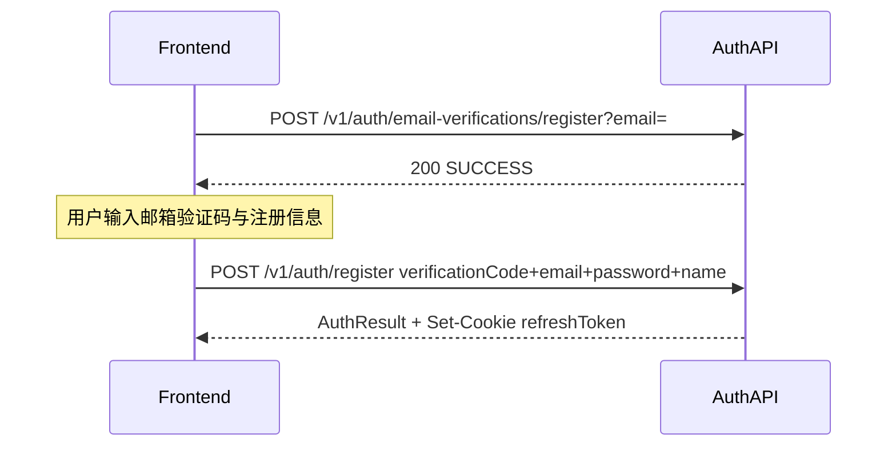
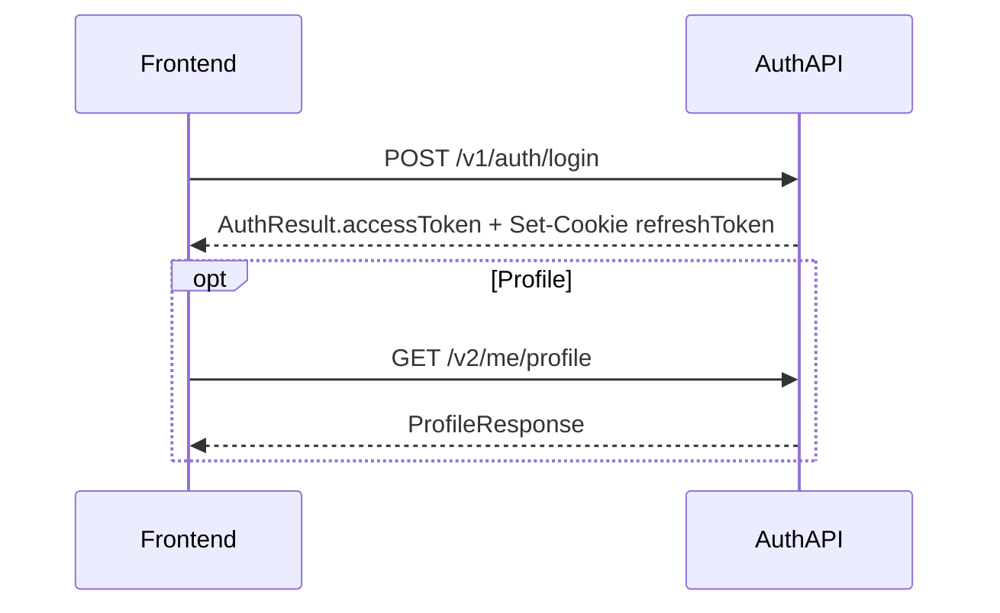
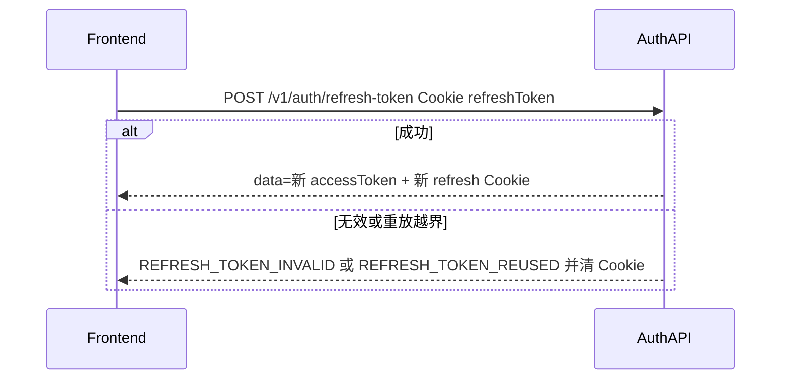
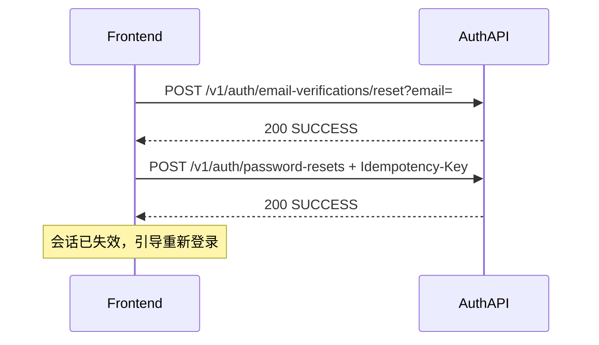
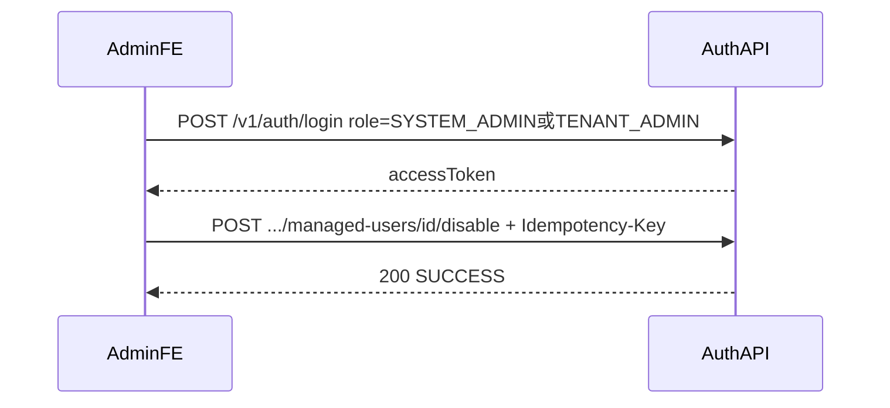
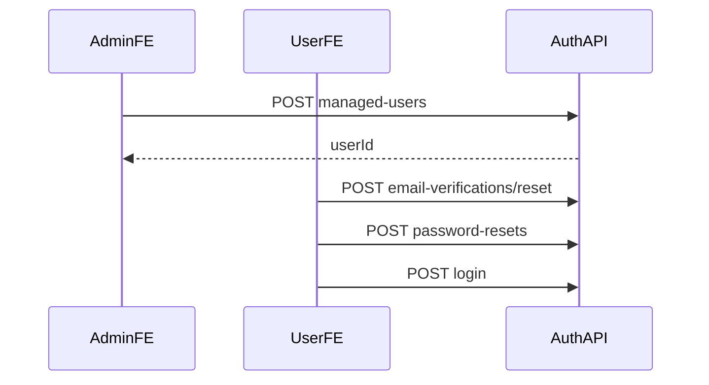

# Auth 模块 API 参考（前端）

登录 / 注册 / 刷新 / 登出 / 邮箱验证 / 改密 / 重置密码，以及系统/租户托管用户管理。  
Base URL：`http://localhost:8080/api`

远程环境可用：`https://dev.xlearnedu.com:8080/api`

个人资料、头像、Users CRUD 见 [`user_module-api.md`](./user_module-api.md)。

---

## 目录

1. [怎么调用](#1-怎么调用)
2. [典型业务流程图](#2-典型业务流程图)
3. [角色与登录路由](#3-角色与登录路由)
4. [Session API](#4-session-api)
5. [邮箱验证与密码](#5-邮箱验证与密码)
6. [Admins（只读）](#6-admins只读)
7. [Managed users（托管用户）](#7-managed-users托管用户)
8. [端点速查表](#8-端点速查表)
9. [本地测试账号](#9-本地测试账号)

---

## 1. 怎么调用

### 1.1 Header

| Header | 何时需要 |
|--------|----------|
| `Authorization: Bearer {accessToken}` | 需登录的接口（如改密、managed-users、admins 读） |
| `Idempotency-Key: {uuid}` | **仅下列写接口**（每次请求用新 UUID） |
| `Content-Type: application/json` | JSON body |

**Auth 模块需要 `Idempotency-Key` 的写接口：**

- `PUT /v1/auth/password`
- `POST /v1/auth/password-resets`
- `POST/PUT` `/v2/system/managed-users...`、`/v2/tenant/managed-users...`（全部写操作）

规则：

- **每个新的业务操作**生成新的 `Idempotency-Key`。
- **同一次操作因超时/断网重试**时必须复用原 Key，且 Method、Path、Query、Body 必须相同。
- 相同 Key + 不同请求内容 → `409 IDEMPOTENCY_KEY_MISMATCH`。
- 相同请求进行中 → `409 IDEMPOTENCY_REQUEST_IN_PROGRESS`。
- Redis 不可用 → `503 IDEMPOTENCY_STORE_UNAVAILABLE`。
- 成功响应默认缓存约 **24 小时**。

缺 Key → `IDEMPOTENCY_KEY_REQUIRED`。

**不需要** Key：`login` / `register` / `refresh-token` / `logout`、发验证码、所有 GET。

Token 无效 / 未认证 → 统一 `ApiResponse`：`401` + `INVALID_TOKEN` / `UNAUTHORIZED`（含 Filter 与 EntryPoint）。

```json
{
  "status": 401,
  "code": "INVALID_TOKEN",
  "message": "Invalid Access Token",
  "timestamp": "2026-07-28T01:00:00Z"
}
```

### 1.2 可匿名访问（JWT 不校验）

- `GET /v1`
- `POST /v1/auth/login`
- `POST /v1/auth/register`
- `POST /v1/auth/refresh-token`
- `POST /v1/auth/logout`
- `POST /v1/auth/email-verifications/register`
- `POST /v1/auth/email-verifications/reset`
- `POST /v1/auth/password-resets`

`PUT /v1/auth/password` **需要** Bearer。

> **没有** `.../register/validate`、`.../reset/validate` 端点。验证码在 `register` / `password-resets` 请求内原子消费（顺序：静态校验 → 消费 → 再做冲突/身份查询，防枚举）。

### 1.3 Cookie：`refreshToken`

| | |
|--|--|
| 谁设置 | `login` / `register` / `refresh-token` 成功时 `Set-Cookie` |
| 属性 | HttpOnly、Secure、SameSite=Lax、path=/、约 14 天 |
| JSON 里有没有 | **没有**。`AuthResult.refreshToken` 只用于服务端写 Cookie，不进响应 body |
| 同源 | 浏览器默认携带 Cookie |
| 跨 Origin | 须 Credentialed Request（`credentials: 'include'`）。**联调临时**：允许 `http://localhost:*` / `http://127.0.0.1:*`（配置 `auth.cors.allowed-origin-patterns`）。上线前应收紧为明确 Origin 列表，禁止裸 `*` |

### 1.4 统一 JSON 响应

成功看 `data`；失败看 `code`（不要只看 HTTP status）。全局 `NON_NULL`：`data=null` 或 `mustChangePassword=null` 时字段可能被省略；前端不要假设每个响应都有 `data`。

```json
{
  "status": 200,
  "code": "SUCCESS",
  "data": {},
  "message": "Success",
  "timestamp": "2026-07-25T01:00:00Z"
}
```

### 1.5 密码规则

至少 **8** 位，且同时含**字母**和**数字**。否则 `INVALID_PASSWORD_FORMAT`（发生在验证码消费之前，不耗码）。

### 1.6 `mustChangePassword`

登录成功的 `AuthResult` 可能带 `mustChangePassword`（boolean；为 `null`/省略视为 false）。

当 `mustChangePassword=true` 时，后端**强制**拒绝普通业务 API：

- HTTP `403`，`code=PASSWORD_CHANGE_REQUIRED`
- 仍允许：`PUT /v1/auth/password`、`POST /v1/auth/logout`、`POST /v1/auth/refresh-token`（后两者为公开路径）

托管用户首次设密应走忘记密码流程（§2.8），不要依赖未知内部密码去调 `PUT /password`。
改密或重置成功后标志清为 `false`，会话失效，需重新登录。
---

## 2. 典型业务流程图

### 2.1 公开注册（两步）

依次调用：

1. `POST /v1/auth/email-verifications/register?email=...` — 发验证码  
2. `POST /v1/auth/register` — body 含 `verificationCode`（**无**中间 validate）



成功后：固定 `role=USER`、`level=STUDENT`、绑定 `tenantId=1`；响应含 `accessToken`，并写 refresh Cookie。

### 2.2 登录进站

1. `POST /v1/auth/login`（body：`email`、`password`、`role`）→ 存 `data.accessToken`  
2. Cookie 自动带 `refreshToken`（勿读 JSON）  
3. （可选）资料页：`GET /v2/me/profile`（见 User 文档；仅 USER / TENANT_ADMIN）  
4. 若 `mustChangePassword === true`：先走 [§2.6 已登录改密](#26-已登录改密)



`role` 决定查哪张表，见 [§3](#3-角色与登录路由)。

### 2.3 Token 续期

1. 浏览器自动带 Cookie `refreshToken`  
2. `POST /v1/auth/refresh-token` → `data` 为**新 accessToken 字符串**（不是对象）  
3. 服务端轮换 refresh Cookie  



- 同 IP 约 60s 内 >10 次 → `TOO_MANY_REQUESTS`  
- 轮换有短暂 grace（默认约 30s）；grace 外重放旧 refresh → `REFRESH_TOKEN_REUSED`，Cookie 被清空，需重新登录  

### 2.4 登出

1. `POST /v1/auth/logout`（**匿名可调**，靠 Cookie；不强制 Bearer）  
2. 服务端删除该 refresh，并清空 Cookie  

前端随后丢弃本地 `accessToken`。

### 2.5 忘记密码（两步）

1. `POST /v1/auth/email-verifications/reset?email=...` — 发重置码  
2. `POST /v1/auth/password-resets` — body：`email` + `verificationCode` + `newPassword`，**需** `Idempotency-Key`  



成功后相关会话失效，需重新 `login`。

### 2.6 已登录改密

1. `PUT /v1/auth/password`（Bearer + `Idempotency-Key`）  
2. body：`currentPassword`、`newPassword`（身份来自 JWT，**不要**再传 email/role）  
3. 成功后 refresh 失效 → 重新登录  

适用 JWT `role`：`USER`、`TENANT_ADMIN`、`SYSTEM_ADMIN`。

### 2.7 托管用户禁用

管理员先登录拿 Bearer，再：

1. `POST /v2/system/managed-users/{id}/disable`（SYSTEM_ADMIN）  
   或 `POST /v2/tenant/managed-users/{id}/disable`（TENANT_ADMIN，同租户）  
2. 账号 → `DISABLED`；enrollment 侧撤出；USER / TENANT_ADMIN 会话失效  



### 2.8 托管用户首次设密

管理员**不知道**也**不能查看**用户密码；系统本轮**不发送**创建邮件或临时密码。

1. Admin：`POST .../managed-users` → 得到 `userId`（`mustChangePassword=true`）
2. 告知用户用自己的邮箱走忘记密码：
   - `POST /v1/auth/email-verifications/reset?email=...`
   - `POST /v1/auth/password-resets`（`email` + `verificationCode` + `newPassword`）
3. 用户再 `POST /v1/auth/login` 正常使用



---

## 3. 角色与登录路由

平台有两层概念：

| 概念 | 取值 | 用途 |
|------|------|------|
| 登录 body `role`（`LoginAccountType`） | `USER` \| `TENANT_ADMIN` \| `SYSTEM_ADMIN` \| `ADMIN` | **只决定查 user 表还是 admin 表** |
| JWT / 授权 `RoleEnum` | `USER` \| `TENANT_ADMIN` \| `SYSTEM_ADMIN` | 鉴权真正使用的角色 |

路由规则：

| 登录 body `role` | 账号表 | JWT 内 role |
|------------------|--------|-------------|
| `USER` | user | `USER` |
| `TENANT_ADMIN` | user | `TENANT_ADMIN` |
| `SYSTEM_ADMIN` | admin | `SYSTEM_ADMIN` |
| `ADMIN`（兼容旧前端） | admin | `SYSTEM_ADMIN` |

`level`（仅 user 表全局字段）：仅允许 `STUDENT` \| `INSTRUCTOR` \| `NOT_APPLICABLE`。  
公开注册固定 `STUDENT`；`TENANT_ADMIN` 强制 `NOT_APPLICABLE`。  
**课程 TA** 属于 Course Enrollment Role，**不是**用户全局 `level`（全局 level 禁止写 `TA`）。

| 能力 | USER | TENANT_ADMIN | SYSTEM_ADMIN |
|------|:----:|:------------:|:------------:|
| 公开自助注册 | ✓ | | |
| 登录 / 刷新 / 登出 | ✓ | ✓ | ✓ |
| `/v2/me/profile` | ✓ | ✓ | （Admin 无此接口） |
| 已登录改密 | ✓ | ✓ | ✓ |
| `/v2/tenant/managed-users` | | ✓ | |
| `/v2/system/managed-users`、`GET /v2/admins` | | | ✓ |

课程内 Instructor / TA / Student 见 Course 文档，与平台 `level` 不是同一套门禁。

---

## 4. Session API

前缀：`/v1/auth`（健康检查：`GET /v1`）

### 4.1 健康检查 — `GET /v1`

无需登录。成功：`data` 为 `"访问成功"`。

---

### 4.2 登录 — `POST /v1/auth/login`

| | |
|--|--|
| 鉴权 | 否 |
| 需要幂等 Key | 否 |

**Body**

| 字段 | 类型 | 必填 | 说明 |
|------|------|------|------|
| email | string | 是 | |
| password | string | 是 | |
| role | string | 是 | 见 §3；须与账号类型一致 |

```json
{
  "email": "regtest1@example.com",
  "password": "Test12345",
  "role": "USER"
}
```

成功 `data`（`AuthResult`）：

```json
{
  "userId": 385,
  "email": "regtest1@example.com",
  "name": "Alex Rivera",
  "username": "regtest1",
  "role": "USER",
  "level": "STUDENT",
  "avatar": "http://localhost:8080/api/v2/users/385/avatar?v=...",
  "accessToken": "eyJ...",
  "mustChangePassword": false
}
```

- 同时 `Set-Cookie: refreshToken=...`
- 无头像时 `avatar` 可为 `null`
- Admin 登录时 `avatar` 可能是库内原始值；JWT 角色为 `SYSTEM_ADMIN`（即使用 body `role=ADMIN`）
- `mustChangePassword`：托管用户首登可能为 `true`

连续失败约 **5** 次会锁约 15 分钟；对调用方统一表现为 `INVALID_CREDENTIALS`（防枚举）。  
Redis 不可用 → `AUTH_SERVICE_TEMPORARILY_UNAVAILABLE`。

其他错误：`PARAM_MISSING`、`TOKEN_CREATION_FAILED`。

---

### 4.3 注册 — `POST /v1/auth/register`

| | |
|--|--|
| 鉴权 | 否 |
| 需要幂等 Key | 否 |
| 前置 | 须先收到 register 验证码（码约 10 分钟有效） |

**Body**

| 字段 | 类型 | 必填 | 说明 |
|------|------|------|------|
| email | string | 是 | |
| verificationCode | string | **是** | 邮箱收到的验证码；在本请求内消费 |
| password | string | 是 | 见 §1.5 |
| name | string | 是 | 显示名 |
| username | string | 否 | 默认取邮箱 `@` 前缀 |
| tenantId | int | 否 | 服务端**始终绑定租户 1**；客户端传入值会被忽略 |

```json
{
  "email": "newuser@example.com",
  "verificationCode": "123456",
  "password": "Test12345",
  "name": "New User"
}
```

成功：形状同登录 `AuthResult` + refresh Cookie。  
固定：`role=USER`、`level=STUDENT`、`tenantId=1`、`emailNotifications=true`。

错误：`PARAM_MISSING`、`INVALID_VERIFICATION_CODE`、`VERIFICATION_CODE_EXPIRED`、`VERIFICATION_ATTEMPTS_EXCEEDED`、`INVALID_PASSWORD_FORMAT`、`BAD_REQUEST`（邮箱已存在等，文案可能防枚举）。

---

### 4.4 刷新 Token — `POST /v1/auth/refresh-token`

| | |
|--|--|
| 鉴权 | 否（靠 Cookie `refreshToken`） |
| 需要幂等 Key | 否 |
| 限流 | 同 IP 约 60s 内 >10 次 → `TOO_MANY_REQUESTS` |

成功：`data` 为**新 accessToken 字符串**；并轮换 refresh Cookie。

```json
{
  "status": 200,
  "code": "SUCCESS",
  "data": "eyJ...",
  "message": "Success"
}
```

错误：`REFRESH_TOKEN_INVALID`、`REFRESH_TOKEN_REUSED`（会清 Cookie）、`TOO_MANY_REQUESTS`、`AUTH_SERVICE_TEMPORARILY_UNAVAILABLE`。

---

### 4.5 登出 — `POST /v1/auth/logout`

| | |
|--|--|
| 鉴权 | **否**（白名单；靠 Cookie） |
| 需要幂等 Key | 否 |

有 Cookie 则删除服务端 refresh 并清空 Cookie；无 Cookie 也返回成功。`data` 为 `null`。

---

## 5. 邮箱验证与密码

### 5.1 发注册验证码 — `POST /v1/auth/email-verifications/register`

| | |
|--|--|
| 鉴权 | 否 |
| 参数 | `email`（建议 query：`?email=`） |

已注册邮箱也会返回成功（静默，防枚举）。

| 规则 | 值 |
|------|-----|
| 码有效期 | 约 **10** 分钟 |
| 重发冷却 | 约 **60** 秒 → `VERIFICATION_RESEND_COOLDOWN` |
| 每小时上限 | 约 **5** 次 → `VERIFICATION_HOURLY_LIMIT` |
| 错误尝试 | 消费时错约 **5** 次 → `VERIFICATION_ATTEMPTS_EXCEEDED` |

**没有**单独的 validate 接口；下一步直接 `POST /v1/auth/register`。

---

### 5.2 发重置验证码 — `POST /v1/auth/email-verifications/reset`

同 §5.1 形态与限流；用户不存在也静默成功。下一步直接 `POST /v1/auth/password-resets`。

---

### 5.3 已登录改密 — `PUT /v1/auth/password`

| | |
|--|--|
| 鉴权 | **需要** Bearer |
| 需要幂等 Key | **是** |

**Body**

| 字段 | 类型 | 必填 | 说明 |
|------|------|------|------|
| currentPassword | string | 是 | 旧密码 |
| newPassword | string | 是 | 新密码，见 §1.5 |

```json
{
  "currentPassword": "Test12345",
  "newPassword": "Test12345a"
}
```

错误：`PARAM_MISSING`、`UNAUTHORIZED`、`INVALID_PASSWORD` / `INVALID_CREDENTIALS`、`INVALID_PASSWORD_FORMAT`、`IDEMPOTENCY_*`。

成功后 bump `authVersion` 并失效会话 → 需重新登录。托管用户改密后会清除 `mustChangePassword`。

---

### 5.4 忘记密码重置 — `POST /v1/auth/password-resets`

| | |
|--|--|
| 鉴权 | 否 |
| 需要幂等 Key | **是** |
| 前置 | 须先收到 reset 验证码 |

**Body**

| 字段 | 类型 | 必填 |
|------|------|------|
| email | string | 是 |
| verificationCode | string | **是** |
| newPassword | string | 是 |

```json
{
  "email": "regtest1@example.com",
  "verificationCode": "123456",
  "newPassword": "Test12345a"
}
```

经 `account_identity` 可改 user 或 admin 密码；成功后会话失效。

错误：`PARAM_MISSING`、`INVALID_VERIFICATION_CODE`、`VERIFICATION_CODE_EXPIRED`、`VERIFICATION_ATTEMPTS_EXCEEDED`、`INVALID_PASSWORD_FORMAT`、`BAD_REQUEST`、`IDEMPOTENCY_*`。

---

## 6. Admins（只读）

前缀：`/v2/admins`  
鉴权：JWT `role=SYSTEM_ADMIN`（`requireSystemAdmin`）。

| 方法 | 路径 | 说明 |
|------|------|------|
| GET | `/v2/admins/{id}` | 查单个 |
| GET | `/v2/admins` | 列表；query：`id` `username` `name` `phone` `email` `avatar` `role` `status` |
| POST / PUT / DELETE | `/v2/admins...` | **一律 Forbidden**（Phase 2 前禁用写接口） |

成功 `data`（`AdminResponse`）字段仅：

`id` `username` `name` `phone` `email` `avatar` `role` `status`

**不返回** `password`、密码哈希、`authVersion`、邀请凭证等内部字段。

Admin **没有** `/v2/me/profile`。登录用 `role: "ADMIN"` 或 `"SYSTEM_ADMIN"`。

---

## 7. Managed users（托管用户）

均需 Bearer + **`Idempotency-Key`**。  
不可通过本接口创建 / 指派 `SYSTEM_ADMIN`。

创建成功返回新用户 `id`；响应**不**含密码；**本轮不发**临时密码邮件。管理员告知用户按 [§2.8](#28-托管用户首次设密) 设密。创建后 `mustChangePassword=true`，在设密前访问业务 API → `403 PASSWORD_CHANGE_REQUIRED`。

`role=USER` 时 `level` 仅 `STUDENT`（默认）或 `INSTRUCTOR`；`role=TENANT_ADMIN` 时 level 强制 `NOT_APPLICABLE`（显式传其它值 → `400`）。

### 7.1 系统管理员 — `/v2/system/managed-users`

鉴权：`SYSTEM_ADMIN`。

#### 创建 — `POST /v2/system/managed-users`

| 字段 | 必填 | 说明 |
|------|------|------|
| email | 是 | |
| name | 是 | |
| role | 是 | `USER` 或 `TENANT_ADMIN` |
| level | 否 | `USER` 时默认 `STUDENT`；`TENANT_ADMIN` 强制 `NOT_APPLICABLE` |
| tenantId | **是** | 目标租户 |

#### 改角色 — `PUT /v2/system/managed-users/{id}/role`

Body：`role`（必填）、`level`（改为 `USER` 时需 `INSTRUCTOR` 或 `STUDENT`）。

#### 禁用 — `POST /v2/system/managed-users/{id}/disable`

账号 `DISABLED` + 撤 enrollment + 失效会话。

---

### 7.2 租户管理员 — `/v2/tenant/managed-users`

鉴权：`TENANT_ADMIN`；租户取自当前登录者，**不能**跨租户。  
不能改自己；不能降级租户内最后一个 `TENANT_ADMIN`。

#### 创建 — `POST /v2/tenant/managed-users`

| 字段 | 必填 | 说明 |
|------|------|------|
| email | 是 | |
| name | 是 | |
| role | 是 | `USER` 或 `TENANT_ADMIN` |
| level | 否 | 同系统侧规则 |
| tenantId | — | **不要传**；使用 actor 租户 |

#### 改角色 / 禁用

- `PUT /v2/tenant/managed-users/{id}/role`
- `POST /v2/tenant/managed-users/{id}/disable`

规则同系统侧，但作用域限制在本租户。

---

## 8. 端点速查表

| 方法 | 路径 | 谁调 | 幂等 Key |
|------|------|------|----------|
| GET | `/v1` | 匿名 | |
| POST | `/v1/auth/login` | 匿名 | |
| POST | `/v1/auth/register` | 匿名 | |
| POST | `/v1/auth/refresh-token` | Cookie | |
| POST | `/v1/auth/logout` | 匿名（Cookie） | |
| POST | `/v1/auth/email-verifications/register` | 匿名 | |
| POST | `/v1/auth/email-verifications/reset` | 匿名 | |
| PUT | `/v1/auth/password` | 已登录 | 是 |
| POST | `/v1/auth/password-resets` | 匿名 | 是 |
| GET | `/v2/admins`、`/v2/admins/{id}` | SYSTEM_ADMIN | |
| POST/PUT/DELETE | `/v2/admins...` | — | 禁用（403） |
| POST | `/v2/system/managed-users` | SYSTEM_ADMIN | 是 |
| PUT | `/v2/system/managed-users/{id}/role` | SYSTEM_ADMIN | 是 |
| POST | `/v2/system/managed-users/{id}/disable` | SYSTEM_ADMIN | 是 |
| POST | `/v2/tenant/managed-users` | TENANT_ADMIN | 是 |
| PUT | `/v2/tenant/managed-users/{id}/role` | TENANT_ADMIN | 是 |
| POST | `/v2/tenant/managed-users/{id}/disable` | TENANT_ADMIN | 是 |

---

## 9. 本地测试账号

**仅适用于本地 Seed / 本地开发数据库。** 不得用于远程 Dev 或生产；那些环境不得依赖文档中的固定测试密码。

| 用途 | email | password | 登录 `role` | 说明 |
|------|-------|----------|-------------|------|
| 学生 | `regtest1@example.com` … `regtest5@example.com` | `Test12345` | `USER` | `level=STUDENT` |
| 教师 | `teachtest2@example.com` | `Test12345` | `USER` | `level=INSTRUCTOR` |
| 平台 Admin | `admin@example.com` | `Test12345` | `ADMIN` 或 `SYSTEM_ADMIN` | admin 表 |

```http
POST /v1/auth/login
Content-Type: application/json

{
  "email": "regtest1@example.com",
  "password": "Test12345",
  "role": "USER"
}
```

响应里取 `data.accessToken` → `Authorization: Bearer ...`。  
资料联调见 [`user_module-api.md`](./user_module-api.md)。
