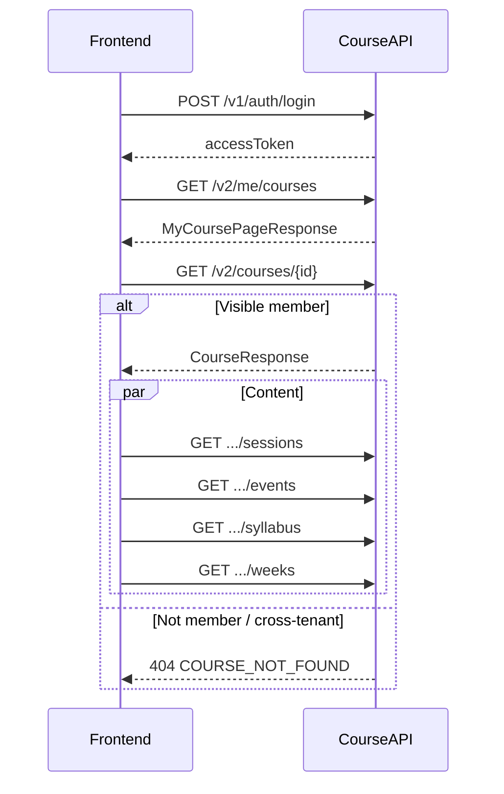
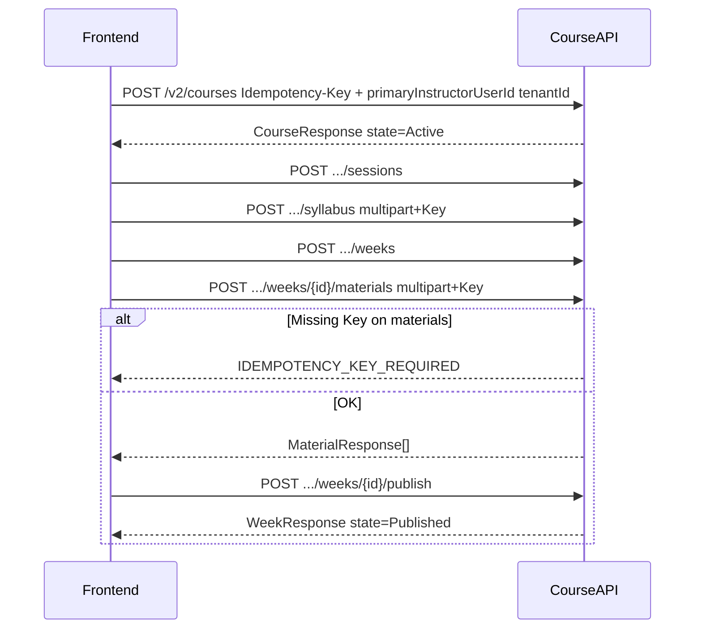
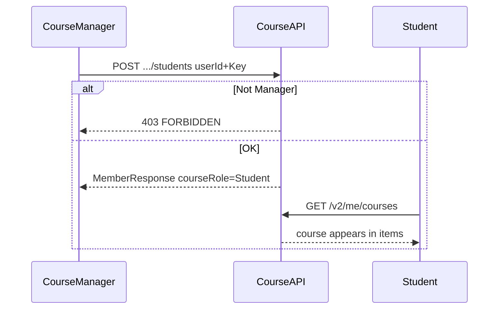
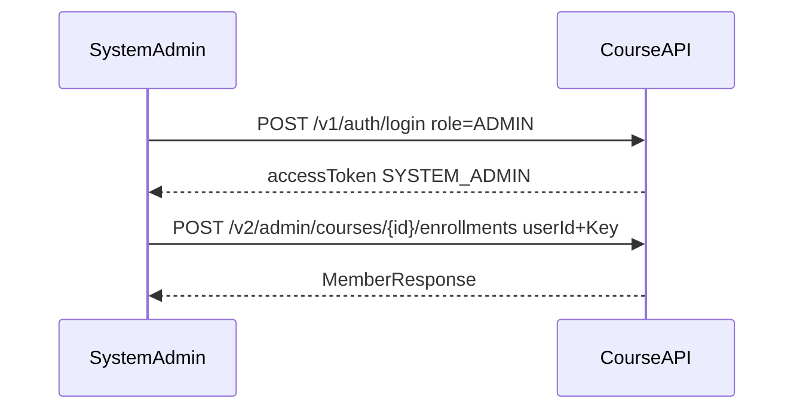
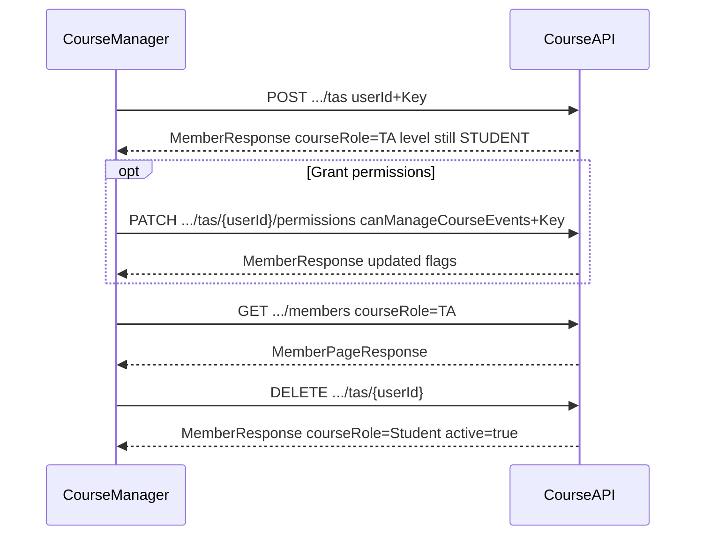
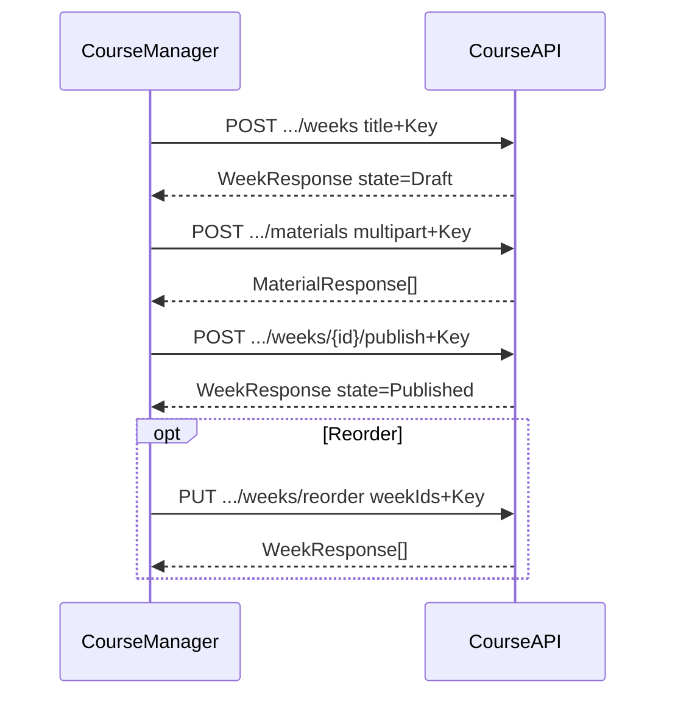
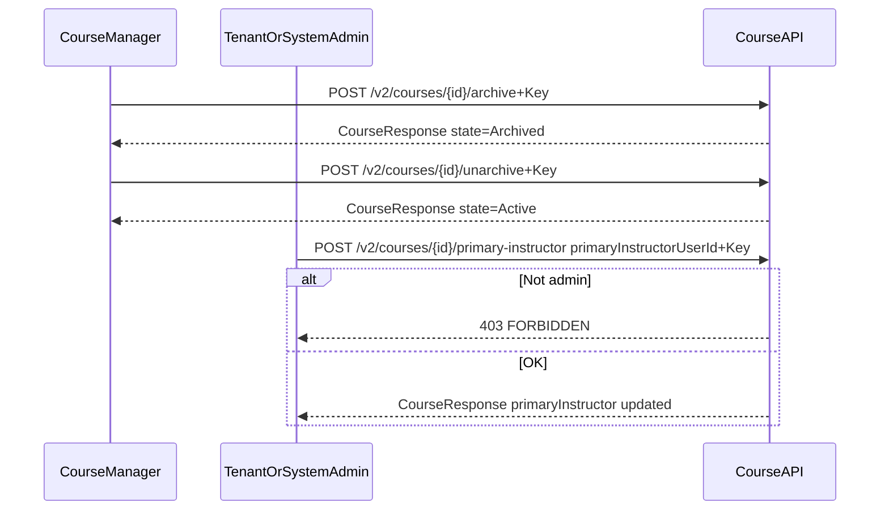

# Course Module API Reference (Frontend)

Courses, enrollments, sessions, events, syllabus, weeks, and materials.  
Base URL: `http://localhost:8080/api`

Remote: `https://dev.xlearnedu.com:8080/api`

Related modules (cross-link only — do not duplicate their APIs here):

- Announcements: [`announcement_module-api.en.md`](./announcement_module-api.en.md)
- Groups: [`group_module-api.en.md`](./group_module-api.en.md)
- Teaching dashboard & personal feeds: [`dashboard_module-api.en.md`](./dashboard_module-api.en.md)

Auth login / tokens: [`auth_module-api.en.md`](./auth_module-api.en.md).

---

## Table of contents

1. [How to call](#1-how-to-call)
2. [Typical business flows](#2-typical-business-flows)
3. [Roles and permissions](#3-roles-and-permissions)
4. [Enums](#4-enums)
5. [Course CRUD](#5-course-crud)
6. [Sessions](#6-sessions)
7. [Events](#7-events)
8. [Members](#8-members)
9. [Students](#9-students)
10. [TAs](#10-tas)
11. [My courses](#11-my-courses)
12. [Admin enroll](#12-admin-enroll)
13. [Syllabus](#13-syllabus)
14. [Weeks, materials, and file streams](#14-weeks-materials-and-file-streams)
15. [Endpoint cheat sheet](#15-endpoint-cheat-sheet)
16. [Local test accounts](#16-local-test-accounts)

---

## 1. How to call

### 1.1 Headers

| Header | When required |
|--------|----------|
| `Authorization: Bearer {accessToken}` | Almost all APIs (login first via `POST /v1/auth/login`) |
| `Idempotency-Key: {uuid}` | **Only the write APIs listed below** (new UUID per request) |
| `Content-Type: application/json` | JSON body |
| `Content-Type: multipart/form-data` | File uploads (browser `FormData` sets this automatically) |

**Course write APIs that require `Idempotency-Key`:**

- `POST /v2/courses`; `PATCH /v2/courses/{id}`; `POST .../archive`; `POST .../unarchive`; `POST .../primary-instructor`
- `POST /v2/courses/{courseId}/students`; `POST .../students/batch`
- `POST /v2/courses/{courseId}/tas`; `PATCH .../tas/{userId}/permissions`
- `POST /v2/admin/courses/{courseId}/enrollments`; `POST .../enrollments/batch`
- `POST/PATCH/PUT .../sessions`; `POST/PUT .../events`
- `POST .../syllabus` (multipart upload); `POST .../syllabus/restore`
- Week writes: `POST/PATCH/PUT .../weeks`, `POST .../publish`, `POST .../unpublish`
- Material writes except delete: `POST .../materials` (**multipart — Key required**), `PATCH`, `PUT .../reorder`, `POST .../move`

Rules:

- Generate a **new** `Idempotency-Key` for each new business operation.
- On timeout/network **retry of the same operation**, reuse the original Key with identical Method, Path, Query, and Body.
- Same Key + different payload → `409 IDEMPOTENCY_KEY_MISMATCH`.
- Missing key on a required write → `IDEMPOTENCY_KEY_REQUIRED`.
- Multipart material upload without Key → `IDEMPOTENCY_KEY_REQUIRED` (enforced before MinIO writes).

**Natural idempotent DELETE** (no Redis Key): withdraw student (`DELETE .../students/{userId}`); remove TA (`DELETE .../tas/{userId}`); delete course / week / material / session / event; syllabus clear.

Invalid / missing auth → unified `ApiResponse`: `401` + `INVALID_TOKEN` / `UNAUTHORIZED`.

### 1.2 Unified JSON response

On success read `data`; on failure read `code`. Global `NON_NULL`: when `data` is null the field may be omitted.

```json
{
  "status": 200,
  "code": "SUCCESS",
  "data": {},
  "message": "Success",
  "timestamp": "2026-07-28T01:00:00Z"
}
```

Preview / download / ZIP responses are **not** this JSON envelope; see [§14.4](#144-handling-file-streams).

### 1.3 Date and time

| Meaning | Example format |
|------|----------|
| Date | `"2026-01-01"` |
| Time | `"09:00:00"` |
| Date-time | `"2026-07-24T15:14:37"` |

Session/event times use the course tenant timezone (returned as `timezone` on session/event objects).

### 1.4 Field name notes

| API | Role field name |
|------|------------|
| `GET /v2/me/courses` | `courseRole` and legacy alias `role` |
| `GET .../members` | `courseRole` |

`orderPosition` (weeks, materials): zero-based and increasing.

---

## 2. Typical business flows

### 2.1 Student enters a course

1. `POST /v1/auth/login` → store `accessToken`
2. `GET /v2/me/courses?state=Active&page=0&size=20` → paginated enrolled courses
3. Open a course: `GET /v2/courses/{id}`
4. In parallel: `GET .../sessions`, `GET .../events`, `GET .../syllabus`, `GET .../weeks` (students only see **Published** weeks)

Not enrolled or cross-tenant → `404 COURSE_NOT_FOUND` (anti-enumeration via `requireVisibleCourse`; **not** `NOT_COURSE_MEMBER`).

There is **no** student self-enroll API. Enrollment is done by a Course Manager (§9) or platform Admin (§12).



### 2.2 Instructor creates and prepares a course

1. `POST /v2/courses` with `primaryInstructorUserId` (+ `tenantId` when caller is Admin) and `Idempotency-Key`
2. `POST .../sessions` (recurring schedule)
3. `POST .../syllabus` (multipart PDF upload + Key)
4. `POST .../weeks` → `POST .../weeks/{weekId}/materials` (multipart + **Key required**) → `POST .../weeks/{weekId}/publish`
5. Optional: `POST .../events`

Platform `level=INSTRUCTOR` may omit `primaryInstructorUserId` (defaults to self). Wrong tenant on create → `TENANT_MISMATCH`. Missing Key on idempotent writes → `IDEMPOTENCY_KEY_REQUIRED`.



### 2.3 Course Manager adds students

**Course Manager** = `SYSTEM_ADMIN` | same-tenant `TENANT_ADMIN` | Active Primary Instructor. **TA is never a Manager.**

1. Manager login
2. `POST /v2/courses/{courseId}/students` `{ "userId": N }` (+ Key), or `POST .../students/batch` (+ Key)
3. Student refreshes `GET /v2/me/courses`

Non-manager mutation → `403 FORBIDDEN`.



### 2.4 Platform Admin enrolls a student

1. Admin login (`role: "ADMIN"` or `"SYSTEM_ADMIN"` → JWT `SYSTEM_ADMIN`)
2. `POST /v2/admin/courses/{courseId}/enrollments` `{ "userId": N }` (+ Key)
3. Student sees course via `GET /v2/me/courses`

Prefer course-scoped `POST .../students` when the caller is already a Course Manager; admin path is for platform operators.



### 2.5 Promote a TA and inspect members

Target must be platform `level=STUDENT` with an **Active Student** enrollment on the same row (in-place Student → TA).

1. Course Manager: `POST /v2/courses/{courseId}/tas` `{ "userId": N }` (+ Key) → audit `TA_ADDED`
2. Optional: `PATCH .../tas/{userId}/permissions` (+ Key; `requireCourseManager` checks **caller only**; target still validated ACTIVE/USER/STUDENT/same tenant)
3. `GET .../members?courseRole=TA&page=0&size=20`
4. Revoke: `DELETE .../tas/{userId}` → restore **Active Student** (not deactivate); audit `TA_REMOVED`; `assignmentSubmitFrozen` stays true

On promote: four permissions default false; end Group Membership (`END_ON_TA_PROMOTION`); Quiz `onMembershipIneligible`. `level=INSTRUCTOR` → `409 LEVEL_ENROLLMENT_MISMATCH`.



### 2.6 Week publish workflow

1. Manager: `POST .../weeks` `{ "title": "Week 1" }`
2. Manager or Active TA: upload materials (multipart + Key)
3. Manager: `POST .../weeks/{weekId}/publish`
4. Optional: `POST .../unpublish`, `PUT .../weeks/reorder`

Archived course writes → `COURSE_ARCHIVED`.



### 2.7 Archive course and reassign primary instructor

1. Course Manager: `POST /v2/courses/{id}/archive` or `.../unarchive` (+ Key)
2. **Only** `SYSTEM_ADMIN` or same-tenant `TENANT_ADMIN`: `POST /v2/courses/{id}/primary-instructor` `{ "primaryInstructorUserId": N }` (+ Key)

Primary Instructor **cannot** self-reassign; non-admin caller → `403 FORBIDDEN`.



---

## 3. Roles and permissions

### 3.1 Platform vs course roles

| Layer | Values | Source |
|-------|--------|--------|
| Platform JWT | `SYSTEM_ADMIN`, `TENANT_ADMIN`, `USER` | Login `role` (Admin `"ADMIN"` / `"SYSTEM_ADMIN"` → `SYSTEM_ADMIN`) |
| User level (USER accounts) | `STUDENT`, `INSTRUCTOR`, … | User profile |
| Course enrollment | `Instructor`, `TA`, `Student` | `courseRole` on enrollment |

Within a course, **Primary Instructor** = the single active enrollment with `courseRole=Instructor`.

### 3.2 Course Manager (canonical write authority)

**Course Manager** = any of:

- Platform `SYSTEM_ADMIN`
- Same-tenant `TENANT_ADMIN`
- Active Primary Instructor (`courseRole=Instructor`, `active=true`)

**TA is never a Course Manager** — even with all permission flags enabled.

Compatibility matrix: platform `level=STUDENT` may hold course `Student`/`TA`; `level=INSTRUCTOR` may hold `Instructor` only. In-course TA keeps global level **STUDENT**.

`requireCourseManager` failures return `403 FORBIDDEN` (not `NOT_COURSE_INSTRUCTOR`). `requireCourseManager` validates the **caller only**, not the target member's tenant.

### 3.3 Capability matrix (summary)

| Capability | Course Manager | TA | Student |
|------------|:--------------:|:--:|:-------:|
| View course / sessions / events / syllabus | ✓ | ✓ | ✓ |
| View Published weeks + materials | ✓ | ✓ | ✓ |
| View Draft weeks | ✓ | ✓ | |
| Create / rename / reorder / publish weeks | ✓ | | |
| Upload materials (file/link) | ✓ | ✓ | |
| Rename / reorder / move materials | ✓ | | |
| Delete material | ✓ any | ✓ own uploads only | |
| Edit sessions | ✓ | | |
| Edit course events | ✓ | needs `canManageCourseEvents` | |
| PATCH course / archive / unarchive / delete | ✓ | | |
| Add / withdraw students | ✓ (`/students`) | | |
| Add / remove TA / patch TA permissions | ✓ (`/tas`) | | |
| List members (`GET .../members`) | ✓ | | |
| Reassign primary instructor | Admin / TenantAdmin only | | |
| Browse `GET /v2/courses` | Admin; platform/course Instructor | | |

When `course.state=Archived`: content/enrollment writes return `COURSE_ARCHIVED`. Reads usually still work.

Invisible / non-member course access → `404 COURSE_NOT_FOUND` (anti-enumeration).

Student enrollment mutations: **`/v2/courses/{courseId}/students`**. TA mutations: **`/v2/courses/{courseId}/tas`**. Member list is **GET-only** on `/members`.

---

## 4. Enums

| Field | Allowed values |
|------|--------|
| `course.state` | `Active` \| `Archived` |
| `courseRole` / `role` | `Instructor` \| `TA` \| `Student` |
| session `type` | `Lecture` \| `Lab` \| `Tutorial` |
| session `dayOfWeek` | `MON` `TUE` `WED` `THU` `FRI` `SAT` `SUN` |
| week `state` | `Draft` \| `Published` |
| material `materialType` | `FILE` \| `LINK` |
| batch item `status` | `SUCCESS` \| `ERROR` |

Invalid enum → usually `400 BAD_REQUEST`.

---

## 5. Course CRUD

Prefix: `/v2/courses`

### 5.1 Browse — `GET /v2/courses`

| | |
|--|--|
| Who | `SYSTEM_ADMIN` (all tenants); `TENANT_ADMIN` (own tenant); platform `level=INSTRUCTOR` or active course Instructor (own courses) |
| Plain Student / TA | `403 ACCESS_DENIED` |
| Query | `q`, `state` (`Active`/`Archived`), `tenantId` (SYSTEM_ADMIN filter only), `page` (default 0), `size` (default 20, max 100) |

Success `data` (`CoursePageResponse`):

```json
{
  "items": [
    {
      "id": 9,
      "courseId": 9,
      "tenantId": 1,
      "courseCode": "DEMO",
      "title": "Demo Course",
      "state": "Active",
      "instructorId": 402,
      "primaryInstructor": { "userId": 402, "name": "Teach Test", "email": "teachtest2@example.com" }
    }
  ],
  "page": 0,
  "size": 20,
  "total": 1
}
```

### 5.2 Create — `POST /v2/courses`

| | |
|--|--|
| Who | Platform `level=INSTRUCTOR` (self as primary); `TENANT_ADMIN` / `SYSTEM_ADMIN` |
| Key | Yes |

**Body**

| Field | Required | Notes |
|------|----------|-------|
| `courseCode` | Yes | max 32 chars |
| `title` | Yes | |
| `termStartDate` / `termEndDate` | Yes | end ≥ start |
| `primaryInstructorUserId` | Admin: Yes; Instructor: optional (defaults to self) | Legacy alias `instructorId` still accepted |
| `tenantId` | SYSTEM_ADMIN: Yes; others: optional (defaults to actor tenant) | Mismatch → `TENANT_MISMATCH` |
| `description`, `location` | No | |

```json
{
  "tenantId": 1,
  "courseCode": "DEMO-2026",
  "title": "Demo Course With Students",
  "termStartDate": "2026-01-01",
  "termEndDate": "2026-06-30",
  "primaryInstructorUserId": 402,
  "description": "optional"
}
```

Success `data` (`CourseResponse`): `state=Active`, `primaryInstructor` populated, `instructorId` mirrors primary user id.

### 5.3 Get — `GET /v2/courses/{id}`

Visible to enrolled members (same tenant) and admins. Not visible → `404 COURSE_NOT_FOUND`.

### 5.4 Update — `PATCH /v2/courses/{id}`

| | |
|--|--|
| Who | Course Manager |
| Key | Yes |
| Body | Partial: `courseCode`, `title`, `termStartDate`, `termEndDate`, `description`, `location`, `clearDescription`, `clearLocation` |
| Forbidden in body | `tenantId`, `primaryInstructorUserId`, `instructorId` (use §5.7 instead) |
| Archived | `COURSE_ARCHIVED` |

Use **PATCH**, not PUT.

### 5.5 Delete — `DELETE /v2/courses/{id}`

Course Manager only. Empty course only (no dependencies, single instructor enrollment). Otherwise `409 CONFLICT` — archive instead.

### 5.6 Archive / unarchive

- `POST /v2/courses/{id}/archive` (+ Key) → `state=Archived`, sets `archivedAt`
- `POST /v2/courses/{id}/unarchive` (+ Key) → `state=Active`

Course Manager. Idempotent when already in target state.

### 5.7 Reassign primary instructor — `POST /v2/courses/{id}/primary-instructor`

| | |
|--|--|
| Who | **Only** `SYSTEM_ADMIN` or same-tenant `TENANT_ADMIN` — **not** Primary Instructor self-service |
| Key | Yes |
| Body | `{ "primaryInstructorUserId": 403 }` |
| Target | Must be active `USER` with `level=INSTRUCTOR`, same tenant |
| Archived | `COURSE_ARCHIVED` |
| Non-admin | `403 FORBIDDEN` |

Effects: updates `course.instructorId`; deactivates previous primary; promotes target to sole active Instructor enrollment.

---

## 6. Sessions

Prefix: `/v2/courses/{courseId}/sessions`

Recurring weekly schedule (distinct from dated **Events** in §7).

| Method | Path | Who (write) | Key |
|--------|------|-------------|-----|
| GET | `/` | Visible member | |
| GET | `/{sessionId}` | Visible member | |
| POST | `/` | Course Manager | Yes |
| PUT | `/{sessionId}` | Course Manager | Yes |
| DELETE | `/{sessionId}` | Course Manager | |

**Create body** (all required):

```json
{
  "type": "Lecture",
  "dayOfWeek": "MON",
  "startTime": "09:00:00",
  "endTime": "10:30:00",
  "location": "A101"
}
```

Success item includes `timezone` (tenant IANA id). Archived course writes → `COURSE_ARCHIVED`. Non-manager → `FORBIDDEN`.

---

## 7. Events

Prefix: `/v2/courses/{courseId}/events`

One-off calendar entries (exam, field trip, etc.).

| Method | Path | Who (write) | Key |
|--------|------|-------------|-----|
| GET | `/` | Visible member | |
| GET | `/{eventId}` | Visible member | |
| POST | `/` | Course Manager **or** Active TA with `canManageCourseEvents` | Yes |
| PUT | `/{eventId}` | Same as POST | Yes |
| DELETE | `/{eventId}` | Same as POST | |

**Create body**:

```json
{
  "name": "Midterm Exam",
  "date": "2026-03-15",
  "startTime": "14:00:00",
  "endTime": "16:00:00",
  "location": "Hall B",
  "description": "optional"
}
```

TA without `canManageCourseEvents` → `403 FORBIDDEN`. Archived → `COURSE_ARCHIVED`.

---

## 8. Members

Prefix: `/v2/courses/{courseId}/members`

**GET-only.** Student/TA enrollment mutations moved to §9 and §10.

### 8.1 List — `GET .../members`

| | |
|--|--|
| Who | Course Manager only |
| Query | `courseRole`, `active`, `q` (name/email), `page`, `size` |

Success `data` (`MemberPageResponse`):

```json
{
  "items": [
    {
      "id": 101,
      "courseId": 9,
      "userId": 385,
      "userName": "Reg Test One",
      "userEmail": "regtest1@example.com",
      "courseRole": "Student",
      "canGrade": false,
      "canPostAnnouncements": false,
      "canManageGroups": false,
      "canManageCourseEvents": false,
      "active": true,
      "enrolledAt": "2026-07-24T16:00:00"
    }
  ],
  "page": 0,
  "size": 20,
  "total": 1
}
```

Non-manager → `403 FORBIDDEN`.

---

## 9. Students

Prefix: `/v2/courses/{courseId}/students`

All routes require **Course Manager**.

| Method | Path | Body | Key |
|--------|------|------|-----|
| POST | `/` | `AdminEnrollRequest`: `{ "userId": N }` | Yes |
| POST | `/batch` | `AdminBatchEnrollRequest`: `{ "userIds": [], "emails": [] }` | Yes |
| DELETE | `/{userId}` | — | No (natural idempotency) |

Batch processes up to **100** identifiers. Per-item result (`BatchStudentEnrollResponse`):

```json
{
  "requestedCount": 2,
  "successCount": 1,
  "failureCount": 1,
  "items": [
    {
      "userId": 385,
      "status": "SUCCESS",
      "errorType": null,
      "message": null,
      "member": { "userId": 385, "courseRole": "Student", "active": true }
    },
    {
      "userId": 999,
      "status": "ERROR",
      "errorType": "USER_NOT_FOUND",
      "message": "...",
      "member": null
    }
  ]
}
```

Withdraw sets `active=false` (soft withdraw). Target must be active Student; otherwise `409 CONFLICT`. Non-manager → `FORBIDDEN`.

---

## 10. TAs

Prefix: `/v2/courses/{courseId}/tas`

All routes require **Course Manager**. TA is a **course role**: account must be `role=USER` + `level=STUDENT`; same Enrollment row flips `Student` ↔ `TA`.

| Method | Path | Body | Key |
|--------|------|------|-----|
| POST | `/` | `{ "userId": N }` — **Active Student → Active TA** | Yes |
| PATCH | `/{userId}/permissions` | four booleans (partial OK) | Yes |
| DELETE | `/{userId}` | — **Active TA → Active Student** (not deactivate) | No |

**POST success:** `courseRole=TA`, `active=true`, four permissions false, `assignmentSubmitFrozen=true`; Group ends with `END_ON_TA_PROMOTION`; Quiz ineligibility hook; audit `TA_ADDED`. Already Active TA → 200 idempotent, no audit.

**POST errors:** `LEVEL_ENROLLMENT_MISMATCH` (non-STUDENT level, HTTP 409); `ENROLLMENT_NOT_FOUND`; `ENROLLMENT_NOT_ACTIVE`; `COURSE_ARCHIVED`; disabled / tenant issues → `ACCOUNT_DISABLED` / `TENANT_MISMATCH`.

**DELETE:** restore Active Student, permissions false, **keep** `assignmentSubmitFrozen=true`; audit `TA_REMOVED`. Active Student repeat DELETE → 200 idempotent. Active Instructor → `409 CONFLICT`. Archived → `COURSE_ARCHIVED`.

**PATCH:** target must be Active TA with USER+STUDENT+same-tenant Active account; caller Manager check does not replace target validation.

```json
{
  "canGrade": true,
  "canPostAnnouncements": false,
  "canManageGroups": false,
  "canManageCourseEvents": true
}
```

Restoring an **inactive TA** via `POST .../students` yields Active Student, permissions off, **does not unfreeze** `assignmentSubmitFrozen`, audit `ENROLLMENT_ROLE_CHANGED`. Active TA cannot be revoked via Student API (use `DELETE .../tas`).

Browse `GET /v2/courses`: Student (including in-course TA) → 403; use `/v2/me/courses`.

---

## 11. My courses

### 11.1 List — `GET /v2/me/courses`

| | |
|--|--|
| Who | `USER` accounts only (admins → `403 FORBIDDEN`) |
| Query | `state` (`Active`/`Archived`), `page`, `size` |

Success `data` (`MyCoursePageResponse`):

```json
{
  "items": [
    {
      "id": 9,
      "courseId": 9,
      "courseCode": "DEMO",
      "title": "Demo Course",
      "state": "Active",
      "courseRole": "Student",
      "role": "Student",
      "primaryInstructor": { "userId": 402, "name": "Teach Test", "email": "teachtest2@example.com" },
      "canGrade": false,
      "canPostAnnouncements": false,
      "canManageGroups": false,
      "canManageCourseEvents": false
    }
  ],
  "page": 0,
  "size": 20,
  "total": 1
}
```

Returns active enrollments in the user's tenant, sorted by course `updatedAt` desc.

---

## 12. Admin enroll

Legacy platform-admin paths. Prefer `POST .../students` when the caller is a Course Manager.

Prefix: `/v2/admin/courses/{courseId}/enrollments`

| Method | Path | Who | Key |
|--------|------|-----|-----|
| POST | `/` | `SYSTEM_ADMIN` only | Yes |
| POST | `/batch` | `SYSTEM_ADMIN` only | Yes |
| DELETE | `/{userId}` | `SYSTEM_ADMIN` only | No |

Body same as §9 (`AdminEnrollRequest` / `AdminBatchEnrollRequest`). Delegates to the same membership service as `/students`.

Example:

```http
POST /api/v2/admin/courses/9/enrollments
Authorization: Bearer {accessToken}
Idempotency-Key: {uuid}
Content-Type: application/json

{ "userId": 385 }
```

Login with `role: "ADMIN"` or `"SYSTEM_ADMIN"` to obtain a JWT with `SYSTEM_ADMIN` authority.

---

## 13. Syllabus

Prefix: `/v2/courses/{courseId}/syllabus`

| Method | Path | Who (write) | Key |
|--------|------|-------------|-----|
| GET | `/` | Visible member | |
| GET | `/preview` | Visible member | stream |
| GET | `/download` | Visible member | stream |
| POST | `/` | Course Manager; multipart `file` (PDF) | Yes |
| POST | `/restore` | Course Manager | Yes |
| DELETE | `/` | Course Manager (logical clear) | No |

**GET JSON** when never uploaded:

```json
{ "posted": false }
```

When posted, includes `versionId`, `originalFilename`, `contentType`, `sizeBytes`, `uploadedBy`, `uploadedAt`. Managers also see `canRestorePrevious`.

Only **PDF** accepted for upload. Archived course writes → `COURSE_ARCHIVED`.

---

## 14. Weeks, materials, and file streams

### 14.1 Weeks

Prefix: `/v2/courses/{courseId}/weeks`

| Method | Path | Who (write) | Key |
|--------|------|-------------|-----|
| GET | `/` | Visible member (students: Published only) | |
| POST | `/` | Course Manager | Yes |
| PATCH | `/{weekId}` | Course Manager; `{ "title": "..." }` | Yes |
| PUT | `/reorder` | Course Manager; `{ "weekIds": [3,1,2] }` full permutation | Yes |
| POST | `/{weekId}/publish` | Course Manager | Yes |
| POST | `/{weekId}/unpublish` | Course Manager | Yes |
| DELETE | `/{weekId}` | Course Manager; empty week only | No |
| GET | `/{weekId}/download.zip` | Visible member | stream |

New week: `state=Draft`, `materials=[]`. Publish makes week visible to students.

```json
{
  "id": 3,
  "courseId": 9,
  "title": "Week 1",
  "orderPosition": 0,
  "state": "Draft",
  "materials": []
}
```

### 14.2 Materials

Prefix: `/v2/courses/{courseId}/weeks/{weekId}/materials`

| Method | Path | Who | Key |
|--------|------|-----|-----|
| POST | `/` | Course Manager or Active TA upload | **Yes (required)** |
| PATCH | `/{materialId}` | Course Manager rename | Yes |
| PUT | `/reorder` | Course Manager | Yes |
| POST | `/{materialId}/move` | Course Manager `{ "targetWeekId": N }` | Yes |
| DELETE | `/{materialId}` | Manager any; TA own uploads | No |
| GET | `/{materialId}/preview` | Visible member | stream |
| GET | `/{materialId}/download` | Visible member | stream or 302 for LINK |

**Multipart create** (`POST`):

| Field | Notes |
|------|------|
| `files` | One or more files (repeat field name) |
| `linkUrl` | Optional external link |
| `linkDisplayName` | Optional link title |
| | At least one of `files` or `linkUrl` |

```js
const fd = new FormData();
fd.append("files", pdfFile);
const res = await fetch(
  `${base}/v2/courses/9/weeks/1/materials`,
  {
    method: "POST",
    headers: {
      Authorization: `Bearer ${accessToken}`,
      "Idempotency-Key": crypto.randomUUID(),
    },
    body: fd,
  }
);
```

Allowed file types: PDF, Office (pptx/docx/xlsx), zip, common images. Max size default **200 MB** (`lms.content.max-file-bytes`).

Success returns `MaterialResponse[]` with `downloadUrl` / `previewUrl` (same-origin API paths) and `previewAvailable` flag.

### 14.3 Week list includes materials

`GET .../weeks` embeds `materials` per week for convenience.

### 14.4 Handling file streams

Applies to: syllabus preview/download, material preview/download, week `download.zip`.

| Point | Notes |
|----|------|
| Auth | `Authorization: Bearer` on every request |
| Success body | Binary stream, **not** `{ status, code, data }` |
| Preview | `Content-Disposition: inline` → blob + object URL |
| Download | `attachment` or follow `downloadUrl` |
| LINK material | `GET .../download` may **302** to external URL |
| Errors | May still return JSON; check `Content-Type` first |

```js
const res = await fetch(url, { headers: { Authorization: `Bearer ${token}` } });
if (!res.ok) {
  const err = await res.json().catch(() => ({}));
  throw err;
}
const blob = await res.blob();
```

---

## 15. Endpoint cheat sheet

Core course controllers only. For announcements, groups, teaching dashboard, and personal feeds, see linked module docs.

| Method | Path | Who | Key |
|--------|------|-----|-----|
| POST | `/v2/courses` | INSTRUCTOR / Admin | Yes |
| GET | `/v2/courses` | Admin / Instructor browse | |
| GET | `/v2/courses/{id}` | Visible member | |
| PATCH | `/v2/courses/{id}` | Course Manager | Yes |
| DELETE | `/v2/courses/{id}` | Course Manager | |
| POST | `/v2/courses/{id}/archive` | Course Manager | Yes |
| POST | `/v2/courses/{id}/unarchive` | Course Manager | Yes |
| POST | `/v2/courses/{id}/primary-instructor` | SYSTEM_ADMIN / TENANT_ADMIN | Yes |
| GET | `/v2/courses/{id}/sessions` | Visible member | |
| GET | `/v2/courses/{id}/sessions/{sessionId}` | Visible member | |
| POST | `/v2/courses/{id}/sessions` | Course Manager | Yes |
| PUT | `/v2/courses/{id}/sessions/{sessionId}` | Course Manager | Yes |
| DELETE | `/v2/courses/{id}/sessions/{sessionId}` | Course Manager | |
| GET | `/v2/courses/{id}/events` | Visible member | |
| GET | `/v2/courses/{id}/events/{eventId}` | Visible member | |
| POST | `/v2/courses/{id}/events` | Manager or event TA | Yes |
| PUT | `/v2/courses/{id}/events/{eventId}` | Manager or event TA | Yes |
| DELETE | `/v2/courses/{id}/events/{eventId}` | Manager or event TA | |
| GET | `/v2/courses/{id}/members` | Course Manager | |
| POST | `/v2/courses/{id}/students` | Course Manager | Yes |
| POST | `/v2/courses/{id}/students/batch` | Course Manager | Yes |
| DELETE | `/v2/courses/{id}/students/{userId}` | Course Manager | |
| POST | `/v2/courses/{id}/tas` | Course Manager | Yes |
| PATCH | `/v2/courses/{id}/tas/{userId}/permissions` | Course Manager | Yes |
| DELETE | `/v2/courses/{id}/tas/{userId}` | Course Manager | |
| GET | `/v2/me/courses` | USER | |
| POST | `/v2/admin/courses/{id}/enrollments` | SYSTEM_ADMIN | Yes |
| POST | `/v2/admin/courses/{id}/enrollments/batch` | SYSTEM_ADMIN | Yes |
| DELETE | `/v2/admin/courses/{id}/enrollments/{userId}` | SYSTEM_ADMIN | |
| GET | `/v2/courses/{id}/syllabus` | Visible member | |
| GET | `/v2/courses/{id}/syllabus/preview` | Visible member | |
| GET | `/v2/courses/{id}/syllabus/download` | Visible member | |
| POST | `/v2/courses/{id}/syllabus` | Course Manager | Yes |
| POST | `/v2/courses/{id}/syllabus/restore` | Course Manager | Yes |
| DELETE | `/v2/courses/{id}/syllabus` | Course Manager | |
| GET | `/v2/courses/{id}/weeks` | Visible member | |
| POST | `/v2/courses/{id}/weeks` | Course Manager | Yes |
| PATCH | `/v2/courses/{id}/weeks/{weekId}` | Course Manager | Yes |
| PUT | `/v2/courses/{id}/weeks/reorder` | Course Manager | Yes |
| POST | `/v2/courses/{id}/weeks/{weekId}/publish` | Course Manager | Yes |
| POST | `/v2/courses/{id}/weeks/{weekId}/unpublish` | Course Manager | Yes |
| DELETE | `/v2/courses/{id}/weeks/{weekId}` | Course Manager | |
| GET | `/v2/courses/{id}/weeks/{weekId}/download.zip` | Visible member | |
| POST | `/v2/courses/{id}/weeks/{weekId}/materials` | Manager / TA upload | **Yes** |
| PATCH | `/v2/courses/{id}/weeks/{weekId}/materials/{materialId}` | Course Manager | Yes |
| PUT | `/v2/courses/{id}/weeks/{weekId}/materials/reorder` | Course Manager | Yes |
| POST | `/v2/courses/{id}/weeks/{weekId}/materials/{materialId}/move` | Course Manager | Yes |
| DELETE | `/v2/courses/{id}/weeks/{weekId}/materials/{materialId}` | Manager; TA own | |
| GET | `/v2/courses/{id}/weeks/{weekId}/materials/{materialId}/preview` | Visible member | |
| GET | `/v2/courses/{id}/weeks/{weekId}/materials/{materialId}/download` | Visible member | |

**Related (other controllers — see linked docs):**

| Module doc | Prefix |
|------------|--------|
| [`announcement_module-api.en.md`](./announcement_module-api.en.md) | `/v2/courses/{id}/announcements`, `/v2/me/announcements/recent` |
| [`group_module-api.en.md`](./group_module-api.en.md) | `/v2/courses/{id}/group-sets/...` |
| [`dashboard_module-api.en.md`](./dashboard_module-api.en.md) | `/v2/me/teaching/...`, `/v2/me/events/upcoming` |

---

## 16. Local test accounts

Password for all: `Test12345`. See [`auth_module-api.en.md`](./auth_module-api.en.md) for login details.

| Use | email | login `role` | Notes |
|-----|-------|--------------|-------|
| Platform Admin | `admin@example.com` | `"ADMIN"` or `"SYSTEM_ADMIN"` | JWT → `SYSTEM_ADMIN`; userId 20 |
| Instructor | `teachtest2@example.com` | `"USER"` | `level=INSTRUCTOR`; use for course create / primary instructor |
| Students | `regtest1@example.com` … `regtest5@example.com` | `"USER"` | userIds 385–389; `level=STUDENT` |

```http
POST /api/v1/auth/login
Content-Type: application/json

{
  "email": "regtest1@example.com",
  "password": "Test12345",
  "role": "USER"
}
```

Take `data.accessToken` → `Authorization: Bearer ...`.

Admin enroll example:

```http
POST /api/v1/auth/login
Content-Type: application/json

{ "email": "admin@example.com", "password": "Test12345", "role": "ADMIN" }
```
