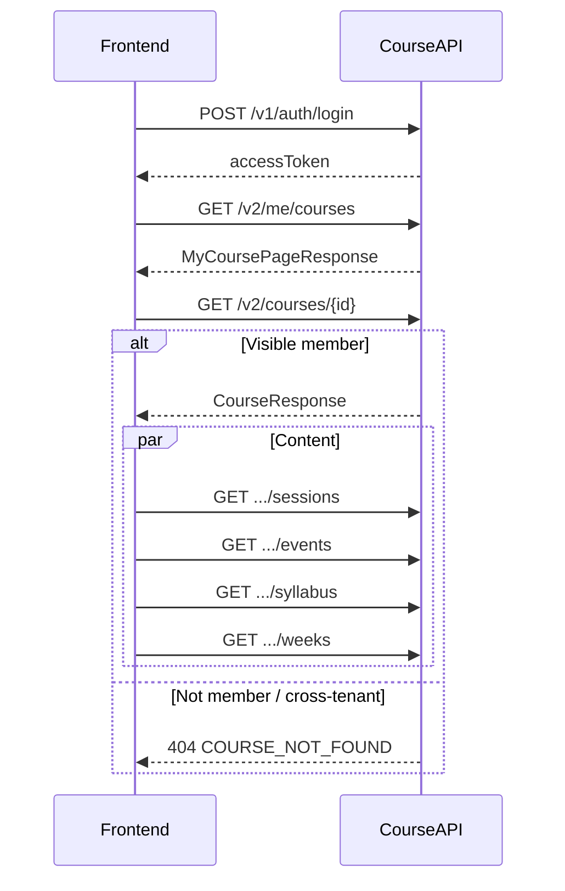
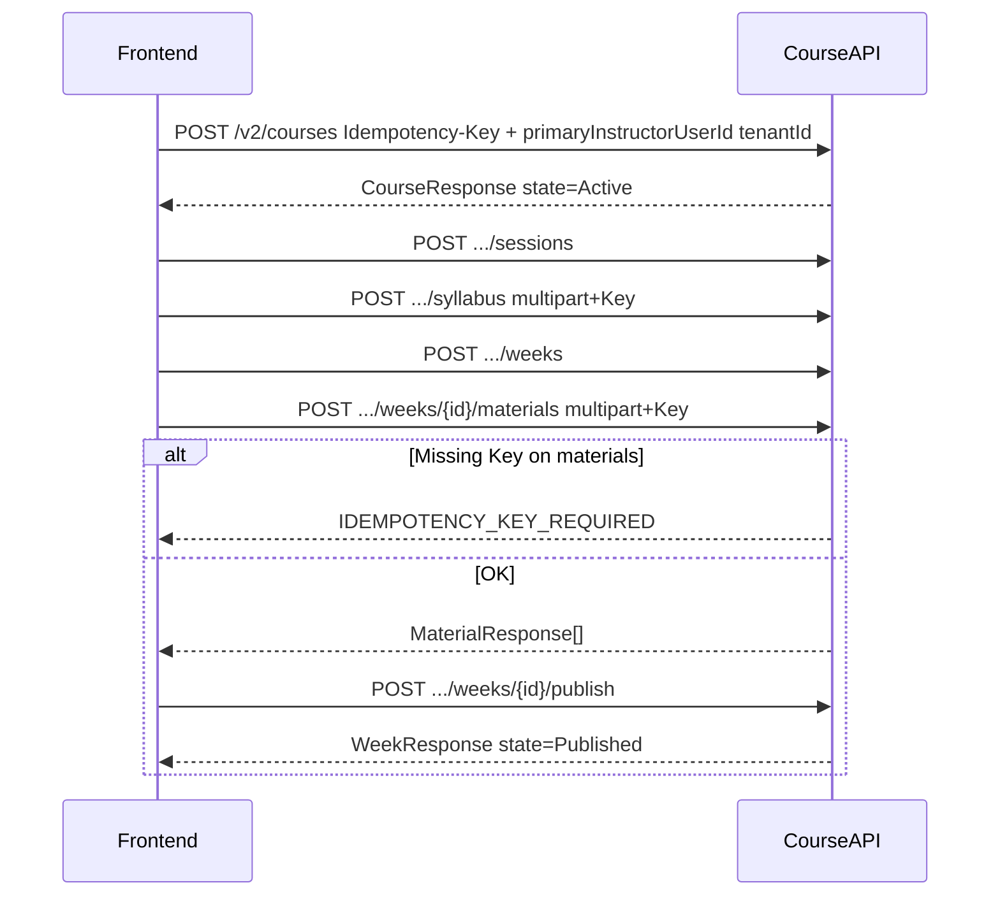
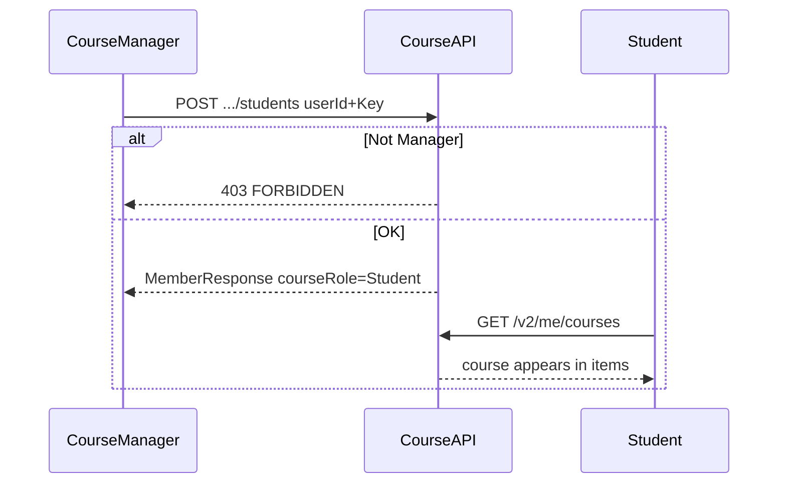
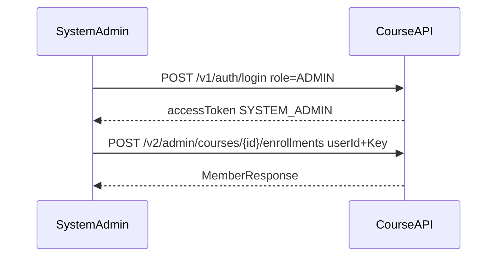
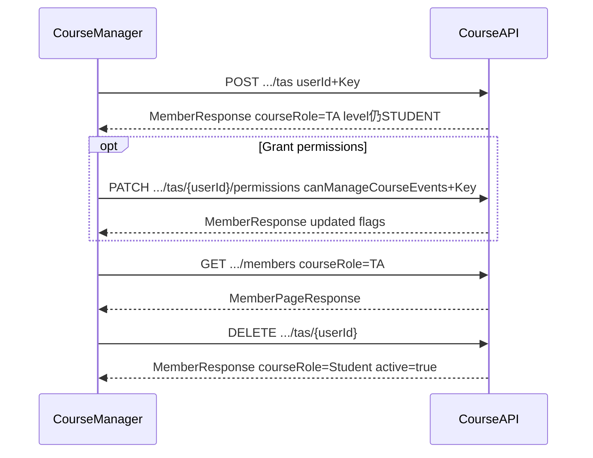
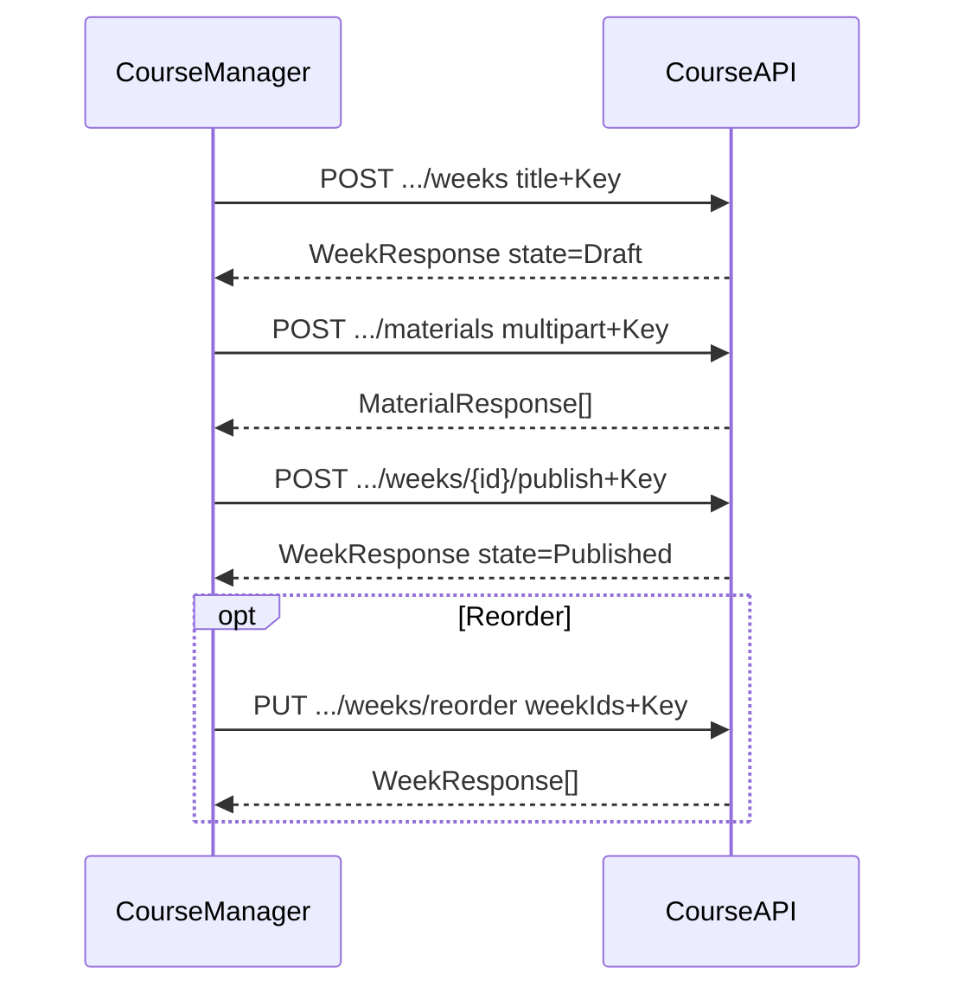
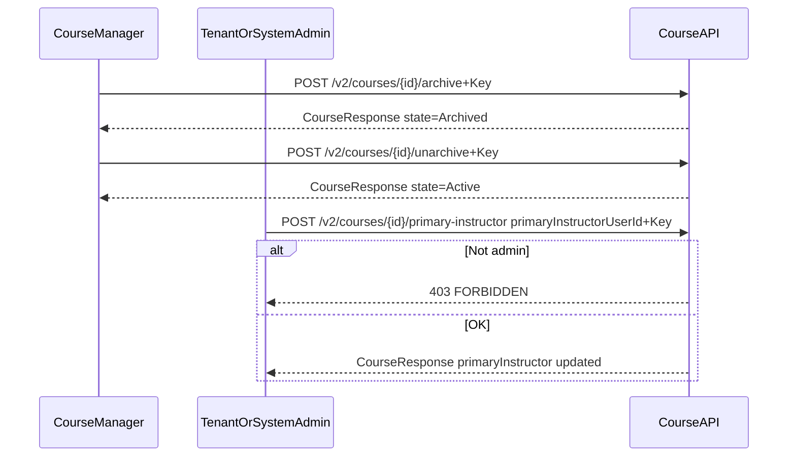

# Course 模块 API 参考（前端）

课程、选课、课时表、事件、教学大纲、周次与资料。  
Base URL：`http://localhost:8080/api`

远程环境可用：`https://dev.xlearnedu.com:8080/api`

相关模块（仅交叉引用，不在此重复其 API）：

- 公告：[`announcement_module-api.md`](./announcement_module-api.md)
- 分组：[`group_module-api.md`](./group_module-api.md)
- 教学仪表盘与个人动态：[`dashboard_module-api.md`](./dashboard_module-api.md)

登录 / Token：[`auth_module-api.md`](./auth_module-api.md)。

---

## 目录

1. [怎么调用](#1-怎么调用)
2. [典型业务流程](#2-典型业务流程)
3. [角色与权限](#3-角色与权限)
4. [枚举](#4-枚举)
5. [Course CRUD](#5-course-crud)
6. [Sessions](#6-sessions)
7. [Events](#7-events)
8. [Members](#8-members)
9. [Students](#9-students)
10. [TAs](#10-tas)
11. [My courses](#11-my-courses)
12. [Admin enroll](#12-admin-enroll)
13. [Syllabus](#13-syllabus)
14. [Weeks、Materials 与文件流](#14-weeks-materials-与文件流)
15. [端点速查表](#15-端点速查表)
16. [本地测试账号](#16-本地测试账号)

---

## 1. 怎么调用

### 1.1 Header

| Header | 何时需要 |
|--------|----------|
| `Authorization: Bearer {accessToken}` | 几乎所有接口（先 `POST /v1/auth/login`） |
| `Idempotency-Key: {uuid}` | **仅下列写接口**（每次新操作生成新 UUID） |
| `Content-Type: application/json` | JSON body |
| `Content-Type: multipart/form-data` | 文件上传（浏览器 `FormData` 会自动设置） |

**Course 模块需要 `Idempotency-Key` 的写接口：**

- `POST /v2/courses`；`PATCH /v2/courses/{id}`；`POST .../archive`；`POST .../unarchive`；`POST .../primary-instructor`
- `POST /v2/courses/{courseId}/students`；`POST .../students/batch`
- `POST /v2/courses/{courseId}/tas`；`PATCH .../tas/{userId}/permissions`
- `POST /v2/admin/courses/{courseId}/enrollments`；`POST .../enrollments/batch`
- `POST/PATCH/PUT .../sessions`；`POST/PUT .../events`
- `POST .../syllabus`（multipart 上传）；`POST .../syllabus/restore`
- Week 写操作：`POST/PATCH/PUT .../weeks`，`POST .../publish`，`POST .../unpublish`
- Material 写操作（删除除外）：`POST .../materials`（**multipart — 必须带 Key**），`PATCH`，`PUT .../reorder`，`POST .../move`

规则：

- **每个新的业务操作**生成新的 `Idempotency-Key`。
- **同一次操作因超时/断网重试**时复用原 Key，且 Method、Path、Query、Body 必须相同。
- 相同 Key + 不同请求体 → `409 IDEMPOTENCY_KEY_MISMATCH`。
- 需要 Key 的写接口缺 Key → `IDEMPOTENCY_KEY_REQUIRED`。
- Multipart 资料上传缺 Key → `IDEMPOTENCY_KEY_REQUIRED`（在写入 MinIO 之前强制校验）。

**天然幂等 DELETE**（无需 Redis Key）：退课学生（`DELETE .../students/{userId}`）；移除 TA（`DELETE .../tas/{userId}`）；删除 course / week / material / session / event；清空 syllabus。

Token 无效 / 未认证 → 统一 `ApiResponse`：`401` + `INVALID_TOKEN` / `UNAUTHORIZED`。

### 1.2 统一 JSON 响应

成功读 `data`；失败读 `code`。全局 `NON_NULL`：`data` 为 null 时该字段可能省略。

```json
{
  "status": 200,
  "code": "SUCCESS",
  "data": {},
  "message": "Success",
  "timestamp": "2026-07-28T01:00:00Z"
}
```

预览 / 下载 / ZIP 响应**不是**此 JSON 包装；见 [§14.4](#144-处理文件流)。

### 1.3 日期与时间

| 含义 | 示例格式 |
|------|----------|
| 日期 | `"2026-01-01"` |
| 时间 | `"09:00:00"` |
| 日期时间 | `"2026-07-24T15:14:37"` |

Session / Event 时间使用课程租户时区（在 session / event 对象上以 `timezone` 返回）。

### 1.4 字段名说明

| API | 角色字段名 |
|------|------------|
| `GET /v2/me/courses` | `courseRole` 及兼容别名 `role` |
| `GET .../members` | `courseRole` |

`orderPosition`（weeks、materials）：从 0 起递增。

---

## 2. 典型业务流程

### 2.1 学生进入课程

1. `POST /v1/auth/login` → 保存 `accessToken`
2. `GET /v2/me/courses?state=Active&page=0&size=20` → 分页返回已选课程
3. 打开课程：`GET /v2/courses/{id}`
4. 并行请求：`GET .../sessions`、`GET .../events`、`GET .../syllabus`、`GET .../weeks`（学生仅可见 **Published** 周次）

未选课或跨租户 → `404 COURSE_NOT_FOUND`（`requireVisibleCourse` 防枚举；**不是** `NOT_COURSE_MEMBER`）。

**没有**学生自助选课 API。选课由 Course Manager（§9）或平台 Admin（§12）完成。



### 2.2 教师创建并准备课程

1. `POST /v2/courses`，带 `primaryInstructorUserId`（Admin 调用时还需 `tenantId`）及 `Idempotency-Key`
2. `POST .../sessions`（重复课时表）
3. `POST .../syllabus`（multipart PDF 上传 + Key）
4. `POST .../weeks` → `POST .../weeks/{weekId}/materials`（multipart + **必须 Key**）→ `POST .../weeks/{weekId}/publish`
5. 可选：`POST .../events`

平台 `level=INSTRUCTOR` 可省略 `primaryInstructorUserId`（默认为本人）。创建时租户不匹配 → `TENANT_MISMATCH`。幂等写操作缺 Key → `IDEMPOTENCY_KEY_REQUIRED`。



### 2.3 Course Manager 添加学生

**Course Manager** = `SYSTEM_ADMIN` | 同租户 `TENANT_ADMIN` | Active Primary Instructor。**TA 永远不是 Manager。**

1. Manager 登录
2. `POST /v2/courses/{courseId}/students` `{ "userId": N }`（+ Key），或 `POST .../students/batch`（+ Key）
3. 学生刷新 `GET /v2/me/courses`

非 Manager 写操作 → `403 FORBIDDEN`。



### 2.4 平台 Admin 为学生选课

1. Admin 登录（`role: "ADMIN"` 或 `"SYSTEM_ADMIN"` → JWT `SYSTEM_ADMIN`）
2. `POST /v2/admin/courses/{courseId}/enrollments` `{ "userId": N }`（+ Key）
3. 学生通过 `GET /v2/me/courses` 看到课程

调用方已是 Course Manager 时优先用课程域 `POST .../students`；Admin 路径供平台运维使用。



### 2.5 提升 TA 并查看成员

目标用户必须是平台 `level=STUDENT`，且该课已有 **Active Student** enrollment（同一条 Enrollment 原地改为 TA）。

1. Course Manager：`POST /v2/courses/{courseId}/tas` `{ "userId": N }`（+ Key）→ 审计 `TA_ADDED`
2. 可选：`PATCH .../tas/{userId}/permissions`（+ Key；`requireCourseManager` **只验调用者**，目标用户另验 ACTIVE/USER/STUDENT/同租户）
3. `GET .../members?courseRole=TA&page=0&size=20`
4. 撤销：`DELETE .../tas/{userId}` → 恢复 **Active Student**（非停用），审计 `TA_REMOVED`；`assignmentSubmitFrozen` 保持 true

提升时：四权限默认 false；结束 Group Membership（`END_ON_TA_PROMOTION`）；Quiz `onMembershipIneligible`。`level=INSTRUCTOR` → `409 LEVEL_ENROLLMENT_MISMATCH`。



### 2.6 周次发布流程

1. Manager：`POST .../weeks` `{ "title": "Week 1" }`
2. Manager 或 Active TA：上传资料（multipart + Key）
3. Manager：`POST .../weeks/{weekId}/publish`
4. 可选：`POST .../unpublish`，`PUT .../weeks/reorder`

已归档课程写操作 → `COURSE_ARCHIVED`。



### 2.7 归档课程与更换主讲教师

1. Course Manager：`POST /v2/courses/{id}/archive` 或 `.../unarchive`（+ Key）
2. **仅** `SYSTEM_ADMIN` 或同租户 `TENANT_ADMIN`：`POST /v2/courses/{id}/primary-instructor` `{ "primaryInstructorUserId": N }`（+ Key）

Primary Instructor **不能**自行更换；非 Admin 调用 → `403 FORBIDDEN`。



---

## 3. 角色与权限

### 3.1 平台角色 vs 课程角色

| 层级 | 取值 | 来源 |
|------|------|------|
| 平台 JWT | `SYSTEM_ADMIN`、`TENANT_ADMIN`、`USER` | 登录 `role`（Admin `"ADMIN"` / `"SYSTEM_ADMIN"` → `SYSTEM_ADMIN`） |
| 用户 level（USER 账号） | `STUDENT`、`INSTRUCTOR`、… | 用户资料 |
| 课程选课 | `Instructor`、`TA`、`Student` | 选课记录上的 `courseRole` |

课程内 **Primary Instructor** = 唯一一条 `courseRole=Instructor` 且 active 的选课记录。

### 3.2 Course Manager（写权限权威定义）

**Course Manager** = 以下任一：

- 平台 `SYSTEM_ADMIN`
- 同租户 `TENANT_ADMIN`
- Active Primary Instructor（`courseRole=Instructor`，`active=true`）

**TA 永远不是 Course Manager** — 即使四个权限标志全部为 true。

兼容矩阵：平台 `level=STUDENT` 可任课内 `Student`/`TA`；`level=INSTRUCTOR` 仅可任 `Instructor`。课内 TA 的全局 level **保持 STUDENT**。

`requireCourseManager` 失败返回 `403 FORBIDDEN`（不是 `NOT_COURSE_INSTRUCTOR`）。`requireCourseManager` **只校验调用者**，不校验目标成员租户。

### 3.3 能力矩阵（摘要）

| 能力 | Course Manager | TA | Student |
|------|:--------------:|:--:|:-------:|
| 查看课程 / sessions / events / syllabus | ✓ | ✓ | ✓ |
| 查看 Published 周次与资料 | ✓ | ✓ | ✓ |
| 查看 Draft 周次 | ✓ | ✓ | |
| 创建 / 重命名 / 排序 / 发布周次 | ✓ | | |
| 上传资料（文件 / 链接） | ✓ | ✓ | |
| 重命名 / 排序 / 移动资料 | ✓ | | |
| 删除资料 | ✓ 任意 | ✓ 仅自己上传 | |
| 编辑 sessions | ✓ | | |
| 编辑课程 events | ✓ | 需 `canManageCourseEvents` | |
| PATCH 课程 / archive / unarchive / delete | ✓ | | |
| 添加 / 退课学生 | ✓（`/students`） | | |
| 添加 / 移除 TA / 修改 TA 权限 | ✓（`/tas`） | | |
| 列出成员（`GET .../members`） | ✓ | | |
| 更换 primary instructor | 仅 Admin / TenantAdmin | | |
| 浏览 `GET /v2/courses` | Admin；平台 / 课程 Instructor | | |

`course.state=Archived` 时：内容 / 选课写操作返回 `COURSE_ARCHIVED`；读操作通常仍可用。

不可见 / 非成员访问课程 → `404 COURSE_NOT_FOUND`（防枚举）。

学生选课变更：**`/v2/courses/{courseId}/students`**。TA 变更：**`/v2/courses/{courseId}/tas`**。成员列表 **仅 GET**，路径 `/members`。

---

## 4. 枚举

| 字段 | 允许值 |
|------|--------|
| `course.state` | `Active` \| `Archived` |
| `courseRole` / `role` | `Instructor` \| `TA` \| `Student` |
| session `type` | `Lecture` \| `Lab` \| `Tutorial` |
| session `dayOfWeek` | `MON` `TUE` `WED` `THU` `FRI` `SAT` `SUN` |
| week `state` | `Draft` \| `Published` |
| material `materialType` | `FILE` \| `LINK` |
| batch item `status` | `SUCCESS` \| `ERROR` |

非法枚举 → 通常 `400 BAD_REQUEST`。

---

## 5. Course CRUD

前缀：`/v2/courses`

### 5.1 浏览 — `GET /v2/courses`

| | |
|--|--|
| 谁 | `SYSTEM_ADMIN`（全租户）；`TENANT_ADMIN`（本租户）；平台 `level=INSTRUCTOR` 或 active 课程 Instructor（自己的课程） |
| 普通 Student / TA | `403 ACCESS_DENIED` |
| Query | `q`、`state`（`Active`/`Archived`）、`tenantId`（仅 SYSTEM_ADMIN 筛选）、`page`（默认 0）、`size`（默认 20，最大 100） |

成功 `data`（`CoursePageResponse`）：

```json
{
  "items": [
    {
      "id": 9,
      "courseId": 9,
      "tenantId": 1,
      "courseCode": "DEMO",
      "title": "Demo Course",
      "state": "Active",
      "instructorId": 402,
      "primaryInstructor": { "userId": 402, "name": "Teach Test", "email": "teachtest2@example.com" }
    }
  ],
  "page": 0,
  "size": 20,
  "total": 1
}
```

### 5.2 创建 — `POST /v2/courses`

| | |
|--|--|
| 谁 | 平台 `level=INSTRUCTOR`（自己为主讲）；`TENANT_ADMIN` / `SYSTEM_ADMIN` |
| Key | 需要 |

**Body**

| 字段 | 必填 | 说明 |
|------|------|------|
| `courseCode` | 是 | 最长 32 字符 |
| `title` | 是 | |
| `termStartDate` / `termEndDate` | 是 | end ≥ start |
| `primaryInstructorUserId` | Admin：是；Instructor：可选（默认本人） | 兼容别名 `instructorId` 仍接受 |
| `tenantId` | SYSTEM_ADMIN：是；其他：可选（默认调用方租户） | 不匹配 → `TENANT_MISMATCH` |
| `description`、`location` | 否 | |

```json
{
  "tenantId": 1,
  "courseCode": "DEMO-2026",
  "title": "Demo Course With Students",
  "termStartDate": "2026-01-01",
  "termEndDate": "2026-06-30",
  "primaryInstructorUserId": 402,
  "description": "optional"
}
```

成功 `data`（`CourseResponse`）：`state=Active`，`primaryInstructor` 已填充，`instructorId` 与 primary user id 一致。

### 5.3 详情 — `GET /v2/courses/{id}`

对已选课成员（同租户）及 Admin 可见。不可见 → `404 COURSE_NOT_FOUND`。

### 5.4 更新 — `PATCH /v2/courses/{id}`

| | |
|--|--|
| 谁 | Course Manager |
| Key | 需要 |
| Body | 部分更新：`courseCode`、`title`、`termStartDate`、`termEndDate`、`description`、`location`、`clearDescription`、`clearLocation` |
| Body 禁止 | `tenantId`、`primaryInstructorUserId`、`instructorId`（用 §5.7） |
| 已归档 | `COURSE_ARCHIVED` |

使用 **PATCH**，不是 PUT。

### 5.5 删除 — `DELETE /v2/courses/{id}`

仅 Course Manager。空课程才可删（无依赖、仅一条 instructor 选课）。否则 `409 CONFLICT` — 请改用 archive。

### 5.6 Archive / unarchive

- `POST /v2/courses/{id}/archive`（+ Key）→ `state=Archived`，设置 `archivedAt`
- `POST /v2/courses/{id}/unarchive`（+ Key）→ `state=Active`

Course Manager。已处于目标状态时幂等。

### 5.7 更换主讲教师 — `POST /v2/courses/{id}/primary-instructor`

| | |
|--|--|
| 谁 | **仅** `SYSTEM_ADMIN` 或同租户 `TENANT_ADMIN` — **不是** Primary Instructor 自助 |
| Key | 需要 |
| Body | `{ "primaryInstructorUserId": 403 }` |
| 目标用户 | 须为同租户 active `USER` 且 `level=INSTRUCTOR` |
| 已归档 | `COURSE_ARCHIVED` |
| 非 Admin | `403 FORBIDDEN` |

效果：更新 `course.instructorId`；停用原 primary；将目标提升为唯一 active Instructor 选课。

---

## 6. Sessions

前缀：`/v2/courses/{courseId}/sessions`

重复周课时表（与 §7 中按日期的 **Events** 不同）。

| Method | Path | 写权限 | Key |
|--------|------|--------|-----|
| GET | `/` | 可见成员 | |
| GET | `/{sessionId}` | 可见成员 | |
| POST | `/` | Course Manager | 是 |
| PUT | `/{sessionId}` | Course Manager | 是 |
| DELETE | `/{sessionId}` | Course Manager | |

**创建 body**（全部必填）：

```json
{
  "type": "Lecture",
  "dayOfWeek": "MON",
  "startTime": "09:00:00",
  "endTime": "10:30:00",
  "location": "A101"
}
```

成功项含 `timezone`（租户 IANA id）。已归档课程写操作 → `COURSE_ARCHIVED`。非 Manager → `FORBIDDEN`。

---

## 7. Events

前缀：`/v2/courses/{courseId}/events`

一次性日历条目（考试、外出等）。

| Method | Path | 写权限 | Key |
|--------|------|--------|-----|
| GET | `/` | 可见成员 | |
| GET | `/{eventId}` | 可见成员 | |
| POST | `/` | Course Manager **或** 带 `canManageCourseEvents` 的 Active TA | 是 |
| PUT | `/{eventId}` | 同 POST | 是 |
| DELETE | `/{eventId}` | 同 POST | |

**创建 body**：

```json
{
  "name": "Midterm Exam",
  "date": "2026-03-15",
  "startTime": "14:00:00",
  "endTime": "16:00:00",
  "location": "Hall B",
  "description": "optional"
}
```

TA 无 `canManageCourseEvents` → `403 FORBIDDEN`。已归档 → `COURSE_ARCHIVED`。

---

## 8. Members

前缀：`/v2/courses/{courseId}/members`

**仅 GET。** 学生 / TA 选课变更已移至 §9 与 §10。

### 8.1 列表 — `GET .../members`

| | |
|--|--|
| 谁 | 仅 Course Manager |
| Query | `courseRole`、`active`、`q`（姓名 / 邮箱）、`page`、`size` |

成功 `data`（`MemberPageResponse`）：

```json
{
  "items": [
    {
      "id": 101,
      "courseId": 9,
      "userId": 385,
      "userName": "Reg Test One",
      "userEmail": "regtest1@example.com",
      "courseRole": "Student",
      "canGrade": false,
      "canPostAnnouncements": false,
      "canManageGroups": false,
      "canManageCourseEvents": false,
      "active": true,
      "enrolledAt": "2026-07-24T16:00:00"
    }
  ],
  "page": 0,
  "size": 20,
  "total": 1
}
```

非 Manager → `403 FORBIDDEN`。

---

## 9. Students

前缀：`/v2/courses/{courseId}/students`

所有路由需 **Course Manager**。

| Method | Path | Body | Key |
|--------|------|------|-----|
| POST | `/` | `AdminEnrollRequest`：`{ "userId": N }` | 是 |
| POST | `/batch` | `AdminBatchEnrollRequest`：`{ "userIds": [], "emails": [] }` | 是 |
| DELETE | `/{userId}` | — | 否（天然幂等） |

Batch 最多处理 **100** 个标识。逐项结果（`BatchStudentEnrollResponse`）：

```json
{
  "requestedCount": 2,
  "successCount": 1,
  "failureCount": 1,
  "items": [
    {
      "userId": 385,
      "status": "SUCCESS",
      "errorType": null,
      "message": null,
      "member": { "userId": 385, "courseRole": "Student", "active": true }
    },
    {
      "userId": 999,
      "status": "ERROR",
      "errorType": "USER_NOT_FOUND",
      "message": "...",
      "member": null
    }
  ]
}
```

退课将 `active=false`（软退课）。目标须为 active Student；否则 `409 CONFLICT`。非 Manager → `FORBIDDEN`。

---

## 10. TAs

前缀：`/v2/courses/{courseId}/tas`

所有路由需 **Course Manager**。TA 是**课程角色**：账号须 `role=USER` + `level=STUDENT`；同一条 Enrollment 上 `Student` ↔ `TA`。

| Method | Path | Body | Key |
|--------|------|------|-----|
| POST | `/` | `{ "userId": N }` — **Active Student → Active TA** | 是 |
| PATCH | `/{userId}/permissions` | 四个布尔（可部分更新） | 是 |
| DELETE | `/{userId}` | — **Active TA → Active Student**（非停用） | 否 |

**POST 成功：** `courseRole=TA`，`active=true`，四权限 false，`assignmentSubmitFrozen=true`；Group 以 `END_ON_TA_PROMOTION` 结束；Quiz 不合格联动；审计 `TA_ADDED`。已是 Active TA → 200 幂等、不写审计。

**POST 常见错误：** `LEVEL_ENROLLMENT_MISMATCH`（非 STUDENT level，HTTP 409）；`ENROLLMENT_NOT_FOUND`；`ENROLLMENT_NOT_ACTIVE`；`COURSE_ARCHIVED`；目标 Disabled / 租户不匹配 → `ACCOUNT_DISABLED` / `TENANT_MISMATCH`。

**DELETE：** 恢复 Active Student，四权限 false，**保持** `assignmentSubmitFrozen=true`；审计 `TA_REMOVED`。Active Student 重复 DELETE → 200 幂等。Active Instructor → `409 CONFLICT`。Archived → `COURSE_ARCHIVED`。

**PATCH：** 目标须 Active TA，且账户仍为 USER+STUDENT+同租户 Active；`requireCourseManager` 不替代目标校验。

**权限 body：**

```json
{
  "canGrade": true,
  "canPostAnnouncements": false,
  "canManageGroups": false,
  "canManageCourseEvents": true
}
```

经 `POST .../students` 恢复 **inactive TA** 时：变为 Active Student，权限全关，**不解冻** `assignmentSubmitFrozen`，审计 `ENROLLMENT_ROLE_CHANGED`。Active TA 不能用 Student API 撤销（须 `DELETE .../tas`）。

管理型 `GET /v2/courses`：Student（含课内 TA）→ 403，请用 `/v2/me/courses`。

---

## 11. My courses

### 11.1 列表 — `GET /v2/me/courses`

| | |
|--|--|
| 谁 | 仅 `USER` 账号（Admin → `403 FORBIDDEN`） |
| Query | `state`（`Active`/`Archived`）、`page`、`size` |

成功 `data`（`MyCoursePageResponse`）：

```json
{
  "items": [
    {
      "id": 9,
      "courseId": 9,
      "courseCode": "DEMO",
      "title": "Demo Course",
      "state": "Active",
      "courseRole": "Student",
      "role": "Student",
      "primaryInstructor": { "userId": 402, "name": "Teach Test", "email": "teachtest2@example.com" },
      "canGrade": false,
      "canPostAnnouncements": false,
      "canManageGroups": false,
      "canManageCourseEvents": false
    }
  ],
  "page": 0,
  "size": 20,
  "total": 1
}
```

返回用户租户内 active 选课，按课程 `updatedAt` 降序。

---

## 12. Admin enroll

遗留平台 Admin 路径。调用方已是 Course Manager 时优先 `POST .../students`。

前缀：`/v2/admin/courses/{courseId}/enrollments`

| Method | Path | 谁 | Key |
|--------|------|-----|-----|
| POST | `/` | 仅 `SYSTEM_ADMIN` | 是 |
| POST | `/batch` | 仅 `SYSTEM_ADMIN` | 是 |
| DELETE | `/{userId}` | 仅 `SYSTEM_ADMIN` | 否 |

Body 同 §9（`AdminEnrollRequest` / `AdminBatchEnrollRequest`）。委托与 `/students` 相同的 membership 服务。

示例：

```http
POST /api/v2/admin/courses/9/enrollments
Authorization: Bearer {accessToken}
Idempotency-Key: {uuid}
Content-Type: application/json

{ "userId": 385 }
```

用 `role: "ADMIN"` 或 `"SYSTEM_ADMIN"` 登录以获取 JWT `SYSTEM_ADMIN` 权限。

---

## 13. Syllabus

前缀：`/v2/courses/{courseId}/syllabus`

| Method | Path | 写权限 | Key |
|--------|------|--------|-----|
| GET | `/` | 可见成员 | |
| GET | `/preview` | 可见成员 | stream |
| GET | `/download` | 可见成员 | stream |
| POST | `/` | Course Manager；multipart `file`（PDF） | 是 |
| POST | `/restore` | Course Manager | 是 |
| DELETE | `/` | Course Manager（逻辑清空） | 否 |

**GET JSON**（从未上传时）：

```json
{ "posted": false }
```

已发布时含 `versionId`、`originalFilename`、`contentType`、`sizeBytes`、`uploadedBy`、`uploadedAt`。Manager 另见 `canRestorePrevious`。

上传仅接受 **PDF**。已归档课程写操作 → `COURSE_ARCHIVED`。

---

## 14. Weeks、Materials 与文件流

### 14.1 Weeks

前缀：`/v2/courses/{courseId}/weeks`

| Method | Path | 写权限 | Key |
|--------|------|--------|-----|
| GET | `/` | 可见成员（学生：仅 Published） | |
| POST | `/` | Course Manager | 是 |
| PATCH | `/{weekId}` | Course Manager；`{ "title": "..." }` | 是 |
| PUT | `/reorder` | Course Manager；`{ "weekIds": [3,1,2] }` 完整排列 | 是 |
| POST | `/{weekId}/publish` | Course Manager | 是 |
| POST | `/{weekId}/unpublish` | Course Manager | 是 |
| DELETE | `/{weekId}` | Course Manager；空周才可删 | 否 |
| GET | `/{weekId}/download.zip` | 可见成员 | stream |

新建周次：`state=Draft`，`materials=[]`。Publish 后对学生可见。

```json
{
  "id": 3,
  "courseId": 9,
  "title": "Week 1",
  "orderPosition": 0,
  "state": "Draft",
  "materials": []
}
```

### 14.2 Materials

前缀：`/v2/courses/{courseId}/weeks/{weekId}/materials`

| Method | Path | 谁 | Key |
|--------|------|-----|-----|
| POST | `/` | Course Manager 或 Active TA 上传 | **是（必须）** |
| PATCH | `/{materialId}` | Course Manager 重命名 | 是 |
| PUT | `/reorder` | Course Manager | 是 |
| POST | `/{materialId}/move` | Course Manager `{ "targetWeekId": N }` | 是 |
| DELETE | `/{materialId}` | Manager 任意；TA 仅自己上传 | 否 |
| GET | `/{materialId}/preview` | 可见成员 | stream |
| GET | `/{materialId}/download` | 可见成员 | stream 或 LINK 时 302 |

**Multipart 创建**（`POST`）：

| 字段 | 说明 |
|------|------|
| `files` | 一个或多个文件（重复字段名） |
| `linkUrl` | 可选外部链接 |
| `linkDisplayName` | 可选链接标题 |
| | `files` 与 `linkUrl` 至少其一 |

```js
const fd = new FormData();
fd.append("files", pdfFile);
const res = await fetch(
  `${base}/v2/courses/9/weeks/1/materials`,
  {
    method: "POST",
    headers: {
      Authorization: `Bearer ${accessToken}`,
      "Idempotency-Key": crypto.randomUUID(),
    },
    body: fd,
  }
);
```

允许文件类型：PDF、Office（pptx/docx/xlsx）、zip、常见图片。默认最大 **200 MB**（`lms.content.max-file-bytes`）。

成功返回 `MaterialResponse[]`，含 `downloadUrl` / `previewUrl`（同源 API 路径）及 `previewAvailable`。

### 14.3 周次列表内嵌 materials

`GET .../weeks` 为方便起见，每个 week 内嵌 `materials`。

### 14.4 处理文件流

适用于：syllabus preview/download、material preview/download、week `download.zip`。

| 要点 | 说明 |
|------|------|
| Auth | 每次请求带 `Authorization: Bearer` |
| 成功 body | 二进制流，**不是** `{ status, code, data }` |
| Preview | `Content-Disposition: inline` → blob + object URL |
| Download | `attachment` 或跟随 `downloadUrl` |
| LINK 资料 | `GET .../download` 可能 **302** 到外部 URL |
| 错误 | 仍可能返回 JSON；先检查 `Content-Type` |

```js
const res = await fetch(url, { headers: { Authorization: `Bearer ${token}` } });
if (!res.ok) {
  const err = await res.json().catch(() => ({}));
  throw err;
}
const blob = await res.blob();
```

---

## 15. 端点速查表

仅 Course 核心控制器。公告、分组、教学仪表盘与个人动态见链接模块文档。

| Method | Path | 谁 | Key |
|--------|------|-----|-----|
| POST | `/v2/courses` | INSTRUCTOR / Admin | 是 |
| GET | `/v2/courses` | Admin / Instructor 浏览 | |
| GET | `/v2/courses/{id}` | 可见成员 | |
| PATCH | `/v2/courses/{id}` | Course Manager | 是 |
| DELETE | `/v2/courses/{id}` | Course Manager | |
| POST | `/v2/courses/{id}/archive` | Course Manager | 是 |
| POST | `/v2/courses/{id}/unarchive` | Course Manager | 是 |
| POST | `/v2/courses/{id}/primary-instructor` | SYSTEM_ADMIN / TENANT_ADMIN | 是 |
| GET | `/v2/courses/{id}/sessions` | 可见成员 | |
| GET | `/v2/courses/{id}/sessions/{sessionId}` | 可见成员 | |
| POST | `/v2/courses/{id}/sessions` | Course Manager | 是 |
| PUT | `/v2/courses/{id}/sessions/{sessionId}` | Course Manager | 是 |
| DELETE | `/v2/courses/{id}/sessions/{sessionId}` | Course Manager | |
| GET | `/v2/courses/{id}/events` | 可见成员 | |
| GET | `/v2/courses/{id}/events/{eventId}` | 可见成员 | |
| POST | `/v2/courses/{id}/events` | Manager 或 event TA | 是 |
| PUT | `/v2/courses/{id}/events/{eventId}` | Manager 或 event TA | 是 |
| DELETE | `/v2/courses/{id}/events/{eventId}` | Manager 或 event TA | |
| GET | `/v2/courses/{id}/members` | Course Manager | |
| POST | `/v2/courses/{id}/students` | Course Manager | 是 |
| POST | `/v2/courses/{id}/students/batch` | Course Manager | 是 |
| DELETE | `/v2/courses/{id}/students/{userId}` | Course Manager | |
| POST | `/v2/courses/{id}/tas` | Course Manager | 是 |
| PATCH | `/v2/courses/{id}/tas/{userId}/permissions` | Course Manager | 是 |
| DELETE | `/v2/courses/{id}/tas/{userId}` | Course Manager | |
| GET | `/v2/me/courses` | USER | |
| POST | `/v2/admin/courses/{id}/enrollments` | SYSTEM_ADMIN | 是 |
| POST | `/v2/admin/courses/{id}/enrollments/batch` | SYSTEM_ADMIN | 是 |
| DELETE | `/v2/admin/courses/{id}/enrollments/{userId}` | SYSTEM_ADMIN | |
| GET | `/v2/courses/{id}/syllabus` | 可见成员 | |
| GET | `/v2/courses/{id}/syllabus/preview` | 可见成员 | |
| GET | `/v2/courses/{id}/syllabus/download` | 可见成员 | |
| POST | `/v2/courses/{id}/syllabus` | Course Manager | 是 |
| POST | `/v2/courses/{id}/syllabus/restore` | Course Manager | 是 |
| DELETE | `/v2/courses/{id}/syllabus` | Course Manager | |
| GET | `/v2/courses/{id}/weeks` | 可见成员 | |
| POST | `/v2/courses/{id}/weeks` | Course Manager | 是 |
| PATCH | `/v2/courses/{id}/weeks/{weekId}` | Course Manager | 是 |
| PUT | `/v2/courses/{id}/weeks/reorder` | Course Manager | 是 |
| POST | `/v2/courses/{id}/weeks/{weekId}/publish` | Course Manager | 是 |
| POST | `/v2/courses/{id}/weeks/{weekId}/unpublish` | Course Manager | 是 |
| DELETE | `/v2/courses/{id}/weeks/{weekId}` | Course Manager | |
| GET | `/v2/courses/{id}/weeks/{weekId}/download.zip` | 可见成员 | |
| POST | `/v2/courses/{id}/weeks/{weekId}/materials` | Manager / TA 上传 | **是** |
| PATCH | `/v2/courses/{id}/weeks/{weekId}/materials/{materialId}` | Course Manager | 是 |
| PUT | `/v2/courses/{id}/weeks/{weekId}/materials/reorder` | Course Manager | 是 |
| POST | `/v2/courses/{id}/weeks/{weekId}/materials/{materialId}/move` | Course Manager | 是 |
| DELETE | `/v2/courses/{id}/weeks/{weekId}/materials/{materialId}` | Manager；TA 仅自己 | |
| GET | `/v2/courses/{id}/weeks/{weekId}/materials/{materialId}/preview` | 可见成员 | |
| GET | `/v2/courses/{id}/weeks/{weekId}/materials/{materialId}/download` | 可见成员 | |

**相关（其他控制器 — 见链接文档）：**

| 模块文档 | 前缀 |
|----------|------|
| [`announcement_module-api.md`](./announcement_module-api.md) | `/v2/courses/{id}/announcements`、`/v2/me/announcements/recent` |
| [`group_module-api.md`](./group_module-api.md) | `/v2/courses/{id}/group-sets/...` |
| [`dashboard_module-api.md`](./dashboard_module-api.md) | `/v2/me/teaching/...`、`/v2/me/events/upcoming` |

---

## 16. 本地测试账号

所有账号密码：`Test12345`。登录细节见 [`auth_module-api.md`](./auth_module-api.md)。

| 用途 | email | 登录 `role` | 说明 |
|------|-------|-------------|------|
| 平台 Admin | `admin@example.com` | `"ADMIN"` 或 `"SYSTEM_ADMIN"` | JWT → `SYSTEM_ADMIN`；userId 20 |
| Instructor | `teachtest2@example.com` | `"USER"` | `level=INSTRUCTOR`；用于建课 / primary instructor |
| Students | `regtest1@example.com` … `regtest5@example.com` | `"USER"` | userId 385–389；`level=STUDENT` |

```http
POST /api/v1/auth/login
Content-Type: application/json

{
  "email": "regtest1@example.com",
  "password": "Test12345",
  "role": "USER"
}
```

取 `data.accessToken` → `Authorization: Bearer ...`。

Admin 选课示例：

```http
POST /api/v1/auth/login
Content-Type: application/json

{ "email": "admin@example.com", "password": "Test12345", "role": "ADMIN" }
```
